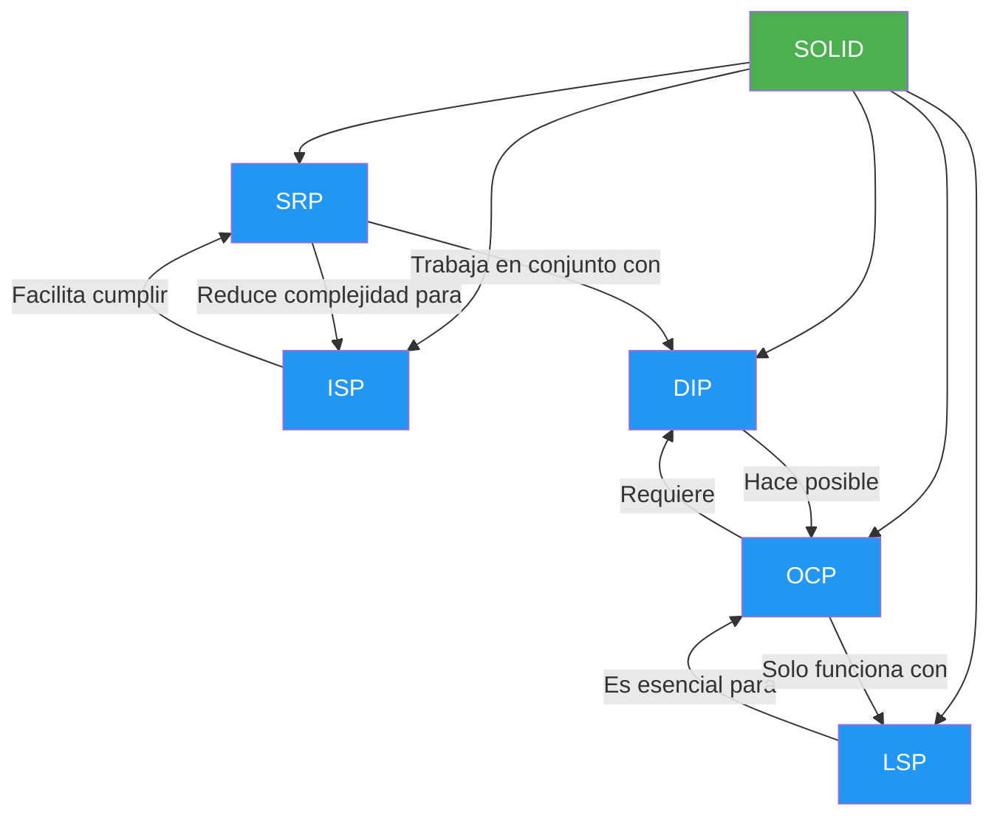
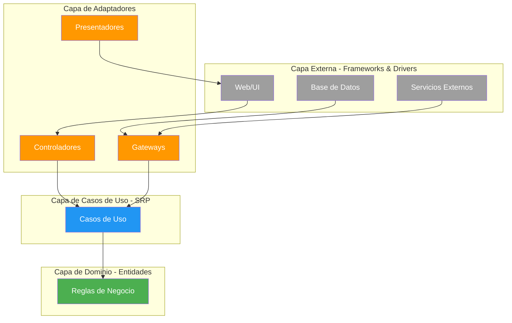

{: .mx-auto.d-block :}

## Historia y Contexto

Los principios SOLID fueron introducidos formalmente por **Robert C. Martin** (conocido como "Uncle Bob") a principios de los años 2000, aunque los principios individuales habían sido desarrollados y discutidos desde finales de los años 80 y durante los 90 por diversos pioneros de la ingeniería de software.

Robert C. Martin es una figura legendaria en el desarrollo de software, autor de libros fundamentales como "Clean Code", "Clean Architecture" y "Agile Software Development: Principles, Patterns, and Practices". Su contribución más significativa fue sintetizar y popularizar estos cinco principios bajo el memorable acrónimo SOLID, facilitando su comprensión y adopción en la industria.

{: .box-success}
**SOLID** es un acrónimo que hace referencia a cinco principios fundamentales del diseño orientado a objetos: **S**ingle responsibility, **O**pen-closed, **L**iskov substitution, **I**nterface segregation and **D**ependency inversion.

Es importante destacar que estos principios no surgieron en el vacío. Son el resultado de años de experiencia práctica en desarrollo de software, observando qué prácticas conducen a código mantenible y cuáles generan sistemas frágiles y difíciles de evolucionar.

### ¿Qué es SOLID?

SOLID representa un conjunto de prácticas del diseño orientado a objetos que nos ayudan a crear software de calidad. Cada letra del acrónimo corresponde a un principio específico:

| Principio | Nombre Completo | Definición Breve | Pregunta Clave |
|-----------|----------------|------------------|----------------|
| **S**RP | Single Responsibility Principle | Un módulo debe tener una sola razón para cambiar | ¿Quién pide este cambio? ¿A qué actor sirve? |
| **O**CP | Open-Closed Principle | Abierto para extensión, cerrado para modificación | ¿Puedo agregar funcionalidad sin modificar código existente? |
| **L**SP | Liskov Substitution Principle | Los subtipos deben ser sustituibles por sus tipos base | ¿Puedo reemplazar este objeto sin romper el sistema? |
| **I**SP | Interface Segregation Principle | Los clientes no deben depender de interfaces que no usan | ¿Esta interfaz obliga a implementar métodos innecesarios? |
| **D**IP | Dependency Inversion Principle | Depende de abstracciones, no de concreciones | ¿Dependo de detalles de implementación o de abstracciones? |

{: .box-warning}
**Importante**: SOLID no es un conjunto de reglas rígidas que deben seguirse dogmáticamente. Son principios guía que nos ayudan a tomar mejores decisiones de diseño. El contexto del proyecto, el tamaño del equipo y los requisitos de negocio siempre deben considerarse.

### Descripción Breve de Cada Principio

**Single Responsibility Principle (SRP)**
Un módulo debe tener una sola razón para cambiar, es decir, debe servir a un único actor o grupo de usuarios con necesidades relacionadas. Este principio promueve la cohesión y reduce el acoplamiento accidental.

**Open-Closed Principle (OCP)**
Las entidades de software deben estar abiertas para extensión pero cerradas para modificación. Esto significa que debemos poder agregar nueva funcionalidad sin cambiar el código existente que ya funciona.

**Liskov Substitution Principle (LSP)**
Los objetos de una clase derivada deben poder reemplazar objetos de la clase base sin alterar el correcto funcionamiento del programa. Esto garantiza que las jerarquías de herencia sean semánticamente correctas.

**Interface Segregation Principle (ISP)**
Es mejor tener múltiples interfaces específicas que una interfaz general. Los clientes no deberían verse obligados a depender de métodos que no utilizan.

**Dependency Inversion Principle (DIP)**
Los módulos de alto nivel no deben depender de módulos de bajo nivel. Ambos deben depender de abstracciones. Las abstracciones no deben depender de detalles, sino que los detalles deben depender de abstracciones.


### ¿Por qué aprenderlos?

Aprender sobre estos principios es fundamental para cualquier desarrollador que quiera escribir código profesional de calidad. Incluso profundizando en solamente alguno de ellos, nos darán herramientas y una noción de cómo estructurar correctamente el código.

{: .box-success}
Dicho esto es necesario aclarar que son simplemente herramientas que tenemos disponibles y es importante saber cuándo hacer un buen uso de ellas. ¿Alguna vez usaste un cuchillo para sacar un tornillo?

Estos principios buscan crear estructuras de módulos de software que sean:

#### 1. Tolerantes al cambio

Ser tolerante al cambio hace referencia a la posibilidad de implementar mejoras o correcciones minimizando el impacto en los módulos existentes, es decir, tocando la menor cantidad de código posible.

**Ejemplo práctico**: Imagina que necesitas agregar un nuevo método de pago a tu sistema de e-commerce. Si has aplicado OCP y DIP correctamente, solo necesitarás crear una nueva clase que implemente la interfaz de pago, sin modificar el código existente de procesamiento de pedidos.

**Contraejemplo**: Sin SOLID, probablemente tendrías que modificar múltiples clases, agregar condiciones `if-else` en varios lugares y arriesgarte a introducir bugs en funcionalidad que ya funcionaba correctamente.

#### 2. Fáciles de comprender

El código va a ser ejecutado por computadoras, pero quienes van a leerlo y mantenerlo son seres humanos. Por eso es fundamental mantenerlo lo más simple posible y con responsabilidades bien definidas.

**Indicador clave**: Si necesitas más de 30 segundos para entender qué hace una clase o método, probablemente está violando SRP.

**Experiencia común**: Luego de pasado un tiempo mirarás tu código y pensarás "¿Qué quise hacer en esta línea?". SOLID ayuda a que ese momento llegue mucho más tarde, o nunca.

#### 3. Reusables

No hay nada mejor que tener módulos de código independientes que puedan ser usados en diferentes aplicaciones o contextos sin modificación.

**Métrica de reusabilidad**: Un módulo bien diseñado con SOLID puede ser extraído y usado en otro proyecto con mínimos o ningún cambio. Si necesitas copiar y modificar código constantemente, probablemente tus módulos están demasiado acoplados.


### Relación Entre los Principios

Los cinco principios SOLID no son independientes, sino que se complementan y refuerzan mutuamente. Entender estas relaciones nos ayuda a aplicarlos de manera más efectiva:



**Sinergias clave:**

- **SRP + ISP**: Ambos trabajan para reducir responsabilidades. SRP lo hace a nivel de clase completa, ISP a nivel de interfaces. Una clase con responsabilidad única naturalmente necesitará interfaces más pequeñas y específicas.

- **OCP + DIP**: Son prácticamente inseparables. Para poder extender funcionalidad sin modificar código (OCP), necesitas depender de abstracciones (DIP). Sin DIP, es casi imposible lograr OCP.

- **LSP + OCP**: La sustitución de Liskov es fundamental para que la extensión por herencia funcione correctamente. Si las subclases no son sustituibles, el polimorfismo que permite OCP simplemente no funcionará.

- **DIP + SRP**: Depender de abstracciones ayuda a delimitar responsabilidades claras. Cuando una clase depende de una abstracción bien definida, es más fácil identificar si está haciendo demasiado.

{: .box-success}
En la práctica, mejorar un principio frecuentemente mejora otros. Por ejemplo, al refactorizar para cumplir SRP, a menudo descubrirás oportunidades para aplicar DIP e ISP.


### Un Ejemplo Práctico Consolidado

Veamos un ejemplo simple que muestra cómo una clase puede violar varios principios SOLID y cómo refactorizarla:

#### Código que viola SOLID:

```java
public class GestorUsuarios {
    private Connection dbConnection;

    // Viola SRP: mezcla lógica de negocio, persistencia y notificación
    // Viola OCP: para agregar nuevo tipo de notificación hay que modificar esta clase
    // Viola DIP: depende de implementaciones concretas
    public void registrarUsuario(String nombre, String email, String password, String tipoNotificacion) {
        // Validación
        if (nombre.length() < 3) {
            throw new IllegalArgumentException("Nombre muy corto");
        }

        // Cifrado
        String passwordCifrada = Base64.getEncoder().encodeToString(password.getBytes());

        // Persistencia directa a base de datos
        try {
            PreparedStatement stmt = dbConnection.prepareStatement(
                "INSERT INTO usuarios (nombre, email, password) VALUES (?, ?, ?)"
            );
            stmt.setString(1, nombre);
            stmt.setString(2, email);
            stmt.setString(3, passwordCifrada);
            stmt.executeUpdate();
        } catch (SQLException e) {
            e.printStackTrace();
        }

        // Notificación con lógica condicional
        if (tipoNotificacion.equals("email")) {
            // Código para enviar email
            System.out.println("Enviando email a: " + email);
        } else if (tipoNotificacion.equals("sms")) {
            // Código para enviar SMS
            System.out.println("Enviando SMS");
        }
    }
}
```

#### Código refactorizado aplicando SOLID:

```java
// SRP: Cada clase tiene una responsabilidad única
// DIP: Todas dependen de abstracciones (interfaces)
// OCP: Se puede extender sin modificar código existente

// Abstracción para cifrado (DIP)
public interface ServicioCifrado {
    String cifrar(String texto);
}

// Abstracción para notificaciones (DIP, ISP)
public interface ServicioNotificacion {
    void notificar(String destinatario, String mensaje);
}

// Abstracción para persistencia (DIP)
public interface RepositorioUsuarios {
    void guardar(Usuario usuario);
}

// Entidad de dominio
public class Usuario {
    private final String nombre;
    private final String email;
    private final String passwordCifrada;

    public Usuario(String nombre, String email, String passwordCifrada) {
        this.nombre = nombre;
        this.email = email;
        this.passwordCifrada = passwordCifrada;
    }

    // Getters
}

// Caso de uso con responsabilidad única (SRP)
public class RegistrarUsuario {
    private final ServicioCifrado servicioCifrado;
    private final RepositorioUsuarios repositorio;
    private final ServicioNotificacion notificador;

    // Constructor con inyección de dependencias (DIP)
    public RegistrarUsuario(
        ServicioCifrado servicioCifrado,
        RepositorioUsuarios repositorio,
        ServicioNotificacion notificador
    ) {
        this.servicioCifrado = servicioCifrado;
        this.repositorio = repositorio;
        this.notificador = notificador;
    }

    public void ejecutar(String nombre, String email, String password) {
        // Validación
        validarDatos(nombre, email, password);

        // Cifrado
        String passwordCifrada = servicioCifrado.cifrar(password);

        // Creación
        Usuario usuario = new Usuario(nombre, email, passwordCifrada);

        // Persistencia
        repositorio.guardar(usuario);

        // Notificación
        notificador.notificar(email, "Bienvenido " + nombre);
    }

    private void validarDatos(String nombre, String email, String password) {
        if (nombre.length() < 3) {
            throw new IllegalArgumentException("Nombre muy corto");
        }
        // Más validaciones...
    }
}

// Implementaciones concretas (pueden extenderse sin modificar el caso de uso - OCP)
public class NotificacionEmail implements ServicioNotificacion {
    @Override
    public void notificar(String destinatario, String mensaje) {
        System.out.println("Email enviado a: " + destinatario);
    }
}

public class NotificacionSMS implements ServicioNotificacion {
    @Override
    public void notificar(String destinatario, String mensaje) {
        System.out.println("SMS enviado");
    }
}

// Nueva implementación sin modificar código existente (OCP, LSP)
public class NotificacionPush implements ServicioNotificacion {
    @Override
    public void notificar(String destinatario, String mensaje) {
        System.out.println("Notificación push enviada");
    }
}
```

**Beneficios de la refactorización:**

✅ **SRP cumplido**: Cada clase tiene una responsabilidad clara
✅ **OCP cumplido**: Podemos agregar nuevos tipos de notificación sin modificar `RegistrarUsuario`
✅ **LSP cumplido**: Todas las implementaciones de `ServicioNotificacion` son intercambiables
✅ **ISP cumplido**: Interfaces pequeñas y específicas
✅ **DIP cumplido**: El caso de uso depende de abstracciones, no de implementaciones concretas


### SOLID y Arquitecturas Modernas

Los principios SOLID no son conceptos aislados del pasado, sino fundamentos que sustentan las arquitecturas modernas de software:

#### Clean Architecture

La **Clean Architecture** de Robert C. Martin es quizás la aplicación más directa de SOLID a nivel arquitectónico:

- **DIP** es el principio central: las capas internas (dominio) no dependen de las externas (infraestructura)
- **SRP** se aplica a cada capa: UI, casos de uso, entidades tienen responsabilidades separadas
- **OCP** permite agregar nuevos casos de uso sin modificar el dominio
- **ISP** se refleja en interfaces de caso de uso específicas para cada actor



{: .box-success}
Para profundizar en cómo SOLID se aplica en Clean Architecture, revisa el post sobre [Casos de uso](https://memobackend.com.ar/2025-01-25-casos-de-uso/).

#### Domain-Driven Design (DDD)

En **DDD**, SOLID ayuda a mantener la integridad del modelo de dominio:

- **SRP** en agregados: cada agregado tiene una responsabilidad de negocio clara
- **DIP** entre capas: la capa de aplicación depende de abstracciones del dominio
- **ISP** en repositorios: interfaces específicas por agregado
- Las entidades enriquecidas aplican **OCP** permitiendo comportamiento extensible

{: .box-success}
Explora más sobre modelos de dominio en [Modelos Anémicos vs. Enriquecidos](https://memobackend.com.ar/2024-06-11-modelos-anemicos-enriquecidos/).

#### Microservicios

En arquitecturas de **microservicios**, SOLID opera a nivel de servicio:

- **SRP**: Cada microservicio tiene una responsabilidad de negocio única
- **OCP**: Los servicios se extienden sin modificar servicios existentes
- **DIP**: Los servicios se comunican a través de contratos (APIs, eventos)
- **ISP**: Las APIs de los servicios son específicas y cohesivas

#### Patrones de Diseño

Los patrones de diseño del Gang of Four son implementaciones concretas de SOLID:

- **Strategy**: Implementa OCP y DIP
- **Decorator**: Aplica OCP para extender comportamiento
- **Factory**: Usa DIP para crear objetos
- **Observer**: Implementa OCP y DIP para notificaciones
- **Adapter**: Aplica ISP y DIP para integración

{: .box-success}
Descubre cómo se relacionan patrones y principios en [Patrones y estilos de software](https://memobackend.com.ar/2024-05-25-patrones-estilos-software/).


### SOLID en la Práctica

Aplicar SOLID en el mundo real requiere equilibrio y criterio. Aquí algunas guías prácticas:

#### Cuándo priorizar cada principio

**En proyectos nuevos pequeños:**
- Priorizar **SRP** y **DIP** desde el inicio
- Ser pragmático con **OCP** (no sobre-diseñar para extensiones futuras inciertas)
- Aplicar **ISP** cuando las interfaces crezcan naturalmente
- **LSP** solo es relevante si usas herencia (prefiere composición)

**En proyectos grandes o legacy:**
- Enfocarse en **SRP** para entender el código existente
- Usar **DIP** para crear costuras y poder testear
- Aplicar **OCP** en puntos de variación conocidos
- **ISP** ayuda a romper dependencias grandes
- **LSP** es crítico cuando se hereda de código legacy

**En sistemas distribuidos:**
- **SRP** a nivel de servicio es fundamental
- **DIP** para desacoplar servicios
- **OCP** para evolucionar APIs sin romper consumidores
- **ISP** para mantener contratos de servicio cohesivos

#### Cuándo es válido "romper" un principio

{: .box-warning}
Los principios SOLID son guías, no leyes. Hay contextos donde puede ser pragmático relajarlos temporalmente.

**Casos válidos:**

1. **Prototipado rápido**: En fase de exploración, prioriza aprender sobre el dominio antes que sobre el diseño perfecto.

2. **Scripts one-off**: Un script que se ejecutará una vez no necesita cumplir SOLID.

3. **Performance crítico**: Si la abstracción impacta significativamente el rendimiento y has medido que es un problema real.

4. **Código trivial**: Una clase con tres líneas no necesita cinco interfaces.

5. **Deadlines imposibles**: Mejor código funcionando que diseño perfecto que nunca se termina (pero documenta la deuda técnica).

**Regla de oro**: Si "rompes" un principio, hazlo conscientemente, documéntalo y planea refactorizar cuando sea oportuno.

#### Relación con Testing

SOLID y testing tienen una relación simbiótica:

**SOLID facilita el testing:**
- **SRP**: Clases pequeñas son fáciles de probar
- **DIP**: Dependencias inyectadas permiten usar mocks/stubs
- **OCP**: Comportamiento extensible es comportamiento testeable
- **ISP**: Interfaces pequeñas son fáciles de simular
- **LSP**: Garantiza que los tests de la clase base sirven para las derivadas

**Testing valida SOLID:**
- Si es difícil escribir un test unitario, probablemente estás violando SRP o DIP
- Si necesitas muchos mocks, puede que estés violando ISP
- Si los tests de la clase base fallan en la derivada, estás violando LSP

```java
// Ejemplo: El testing es fácil gracias a DIP
public class RegistrarUsuarioTest {
    @Test
    public void debeRegistrarUsuarioCorrectamente() {
        // Mocks fáciles de crear gracias a las interfaces (DIP)
        ServicioCifrado cifradoMock = mock(ServicioCifrado.class);
        RepositorioUsuarios repoMock = mock(RepositorioUsuarios.class);
        ServicioNotificacion notifMock = mock(ServicioNotificacion.class);

        when(cifradoMock.cifrar("password123"))
            .thenReturn("encrypted");

        // El caso de uso es fácil de probar (SRP)
        RegistrarUsuario useCase = new RegistrarUsuario(
            cifradoMock, repoMock, notifMock
        );

        useCase.ejecutar("Juan", "juan@example.com", "password123");

        // Verificaciones claras
        verify(repoMock).guardar(any(Usuario.class));
        verify(notifMock).notificar(eq("juan@example.com"), anyString());
    }
}
```


### Errores Comunes al Aplicar SOLID

Conocer los errores frecuentes te ayudará a evitarlos:

#### 1. Sobre-ingeniería por aplicación dogmática

**Error**: Crear múltiples capas de abstracción para código simple.

```java
// Excesivo para una operación simple
public interface CalculadoraEdadStrategy {
    int calcular(LocalDate fechaNacimiento);
}

public class CalculadoraEdadStrategyImpl implements CalculadoraEdadStrategy {
    // 3 líneas de lógica con 20 líneas de infraestructura
}
```

**Solución**: Usa SOLID cuando agregue valor, no por dogma. Una función simple puede quedarse simple.

#### 2. Confundir SRP con "hace una sola cosa"

**Error**: Dividir clases hasta el absurdo pensando que cada método debe ser una clase.

```java
// Excesivo
public class ValidadorNombre { }
public class ValidadorEmail { }
public class ValidadorPassword { }
public class ValidadorTelefono { }
// ... 20 clases más para validación simple
```

**Solución**: SRP es sobre "una razón para cambiar", no "una línea de código". Un validador de formulario puede validar múltiples campos si todos cambian por el mismo actor (UX team, por ejemplo).

#### 3. Crear abstracciones prematuras (DIP mal aplicado)

**Error**: Crear interfaces "por si acaso" antes de tener un segundo caso de uso real.

```java
// Innecesario si solo tendrás MySQL
public interface DatabaseConnection { }
public class MySQLConnection implements DatabaseConnection { }
// Única implementación que existirá
```

**Solución**: "You Aren't Gonna Need It" (YAGNI). Crea abstracciones cuando tengas variación real o puntos de extensión conocidos, no especulativos.

#### 4. Herencia excesiva violando LSP

**Error**: Usar herencia para reusar código en lugar de modelar relaciones "es-un".

```java
// Violación de LSP
public class Rectangulo {
    protected int ancho, alto;
    public void setAncho(int ancho) { this.ancho = ancho; }
    public void setAlto(int alto) { this.alto = alto; }
}

public class Cuadrado extends Rectangulo {
    // Rompe el contrato: setAncho también cambia alto
    @Override
    public void setAncho(int lado) {
        this.ancho = lado;
        this.alto = lado;
    }
}
```

**Solución**: Prefiere composición sobre herencia. Si usas herencia, asegúrate que la subclase realmente "es un" supertipo sin cambiar el comportamiento esperado.

#### 5. Interfaces gordas (violación de ISP)

**Error**: Crear interfaces monolíticas que obligan a implementar métodos innecesarios.

```java
// Mala práctica
public interface ServicioUsuario {
    void crear(Usuario u);
    void actualizar(Usuario u);
    void eliminar(int id);
    List<Usuario> buscar(String criterio);
    void enviarEmail(Usuario u, String mensaje);
    void generarReporte(Usuario u);
    void sincronizarConLDAP(Usuario u);
    // ... 15 métodos más
}
```

**Solución**: Divide en interfaces cohesivas (RepositorioUsuario, NotificadorUsuario, GeneradorReportes, etc.).

#### 6. No aplicar SOLID a nivel de módulos/paquetes

**Error**: Aplicar SOLID solo a clases individuales pero no a la organización de paquetes.

**Solución**: SOLID también aplica a módulos completos. Un paquete puede tener una responsabilidad única, estar abierto para extensión, etc.


### Indicadores de que Estás Aplicando SOLID Correctamente

**Señales positivas:**

✅ Tus clases tienen menos de 200 líneas en promedio
✅ Puedes escribir tests unitarios fácilmente sin inicializar media aplicación
✅ Agregar nueva funcionalidad rara vez requiere modificar código existente
✅ Cuando algo cambia, sabes exactamente qué clase modificar
✅ Puedes explicar en una oración qué hace cada clase
✅ Tus compañeros entienden tu código sin necesitar explicaciones extensas
✅ Reemplazar dependencias (por ejemplo, cambiar de base de datos) es relativamente simple

**Señales de alerta:**

⚠️ Clases con más de 500 líneas
⚠️ Nombres de clase con "And", "Manager", "Util", "Helper"
⚠️ Métodos con más de 5 parámetros
⚠️ Dificultad para escribir tests sin base de datos o servicios externos
⚠️ Cambios simples requieren tocar 10+ archivos
⚠️ Miedo a refactorizar porque "algo podría romperse"
⚠️ Copiar-pegar código porque es "más fácil que reutilizar"


### Conclusión

Los principios SOLID son herramientas fundamentales en el arsenal de cualquier desarrollador profesional. No son reglas absolutas, sino guías basadas en décadas de experiencia en la industria del software que nos ayudan a tomar mejores decisiones de diseño.

**Puntos clave para recordar:**

1. **SOLID es un conjunto complementario**: Los cinco principios trabajan juntos y se refuerzan mutuamente. Mejorar uno frecuentemente mejora los demás.

2. **Contexto sobre dogma**: Aplica estos principios con criterio. Un script de 20 líneas no necesita la misma arquitectura que un sistema empresarial.

3. **Beneficios comprobados**: Código más mantenible, tolerante al cambio y fácil de probar no son promesas vacías, sino resultados medibles de aplicar SOLID correctamente.

4. **Fundamento de arquitecturas modernas**: Clean Architecture, DDD, microservicios y patrones de diseño están construidos sobre estos principios.

5. **Aprendizaje continuo**: SOLID es fácil de entender en teoría pero requiere práctica para dominar en situaciones reales.

{: .box-success}
La mejor manera de aprender SOLID es aplicándolo. Comienza revisando tu código actual: ¿qué principios se están violando? ¿Qué problemas de mantenimiento podrían resolverse aplicándolos? Refactoriza una clase a la vez.

### Próximos Pasos

Te invito a profundizar en cada principio individualmente:

[](https://memobackend.com.ar/2024-04-15-principio-responsabilidad-única/)

[](https://memobackend.com.ar/2024-04-29-principio-de-abierto-cerrado/)

[](https://memobackend.com.ar/2024-05-09-principio-sustitucion-liskov/)

[](https://memobackend.com.ar/2024-05-15-principio-segregacion-de-intrefaces/)

[](https://memobackend.com.ar/2024-05-18-principio-inversión-de-la-dependencia/)

[](https://memobackend.com.ar/tags/#solid)

{: .mx-auto.d-block :}

---

*Última actualización: 8 de marzo de 2026*
