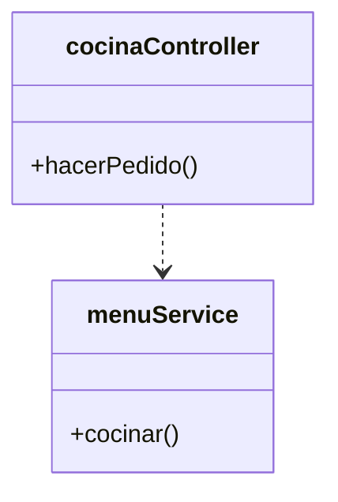
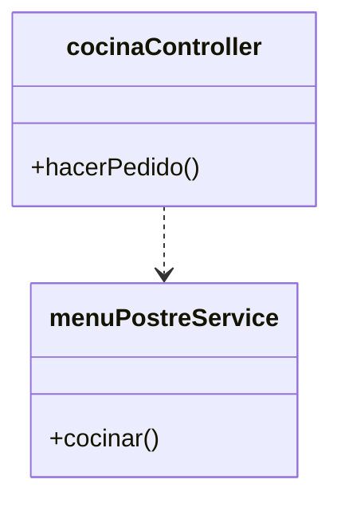
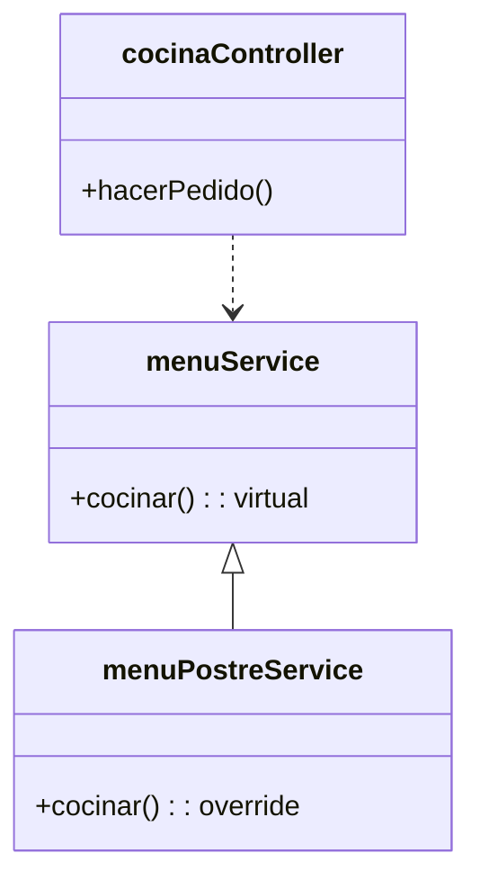
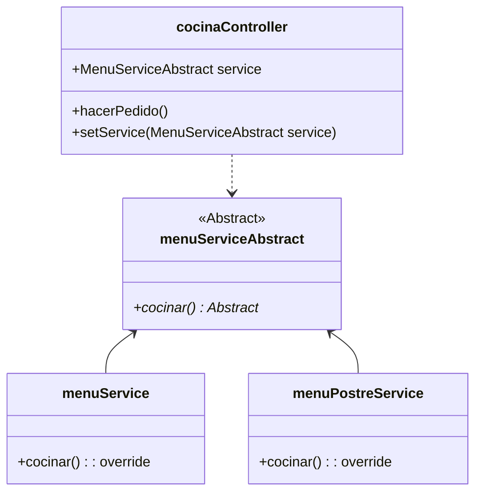
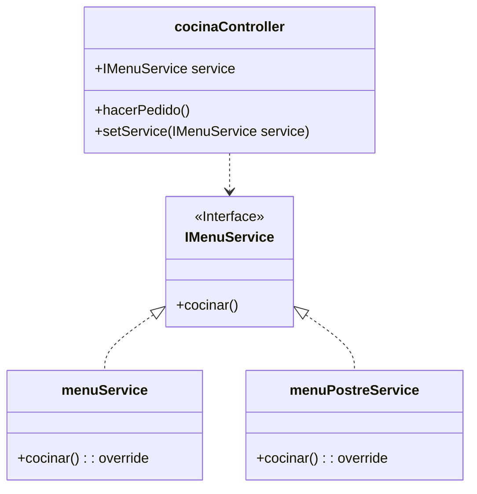

## OCP: Open/Closed principle

Es la **O** en SOLID y viene del ingles "open/closed principle".
Este término fue creado por Bertrand Meyer en 1988, y definió la regla como:

{: .box-success} 
Un módulo debe estar abierto a la extensión pero cerrado a la modificación.

Esta definición parece ser contradictoria por incluir en la definición dos cosas opuestas, pero en realidad hacen referencia a distintas cosas. 

### ¿Cómo puede ser algo abierto y cerrado a la vez?

Veamos una segunda definición para aclarar más el tema, esta definición es la que nos da Robert C. Martin (Desarrollo ágil de software: principios, patrones y prácticas - Prentice Hall, 2003):

{: .box-note}
**“Abierto para extensión”:** Esto significa que el comportamiento del módulo se puede ampliar. 
A medida que cambian los requisitos de la aplicación, podemos ampliar el módulo con nuevos comportamientos que satisfagan esos cambios. En otras palabras, podemos cambiar lo que hace el módulo.

{: .box-note}
**“Cerrado a modificaciones”:** Ampliar el comportamiento de un módulo no da como resultado cambios en el código fuente o binario del módulo. 
La versión binaria ejecutable del módulo, ya sea en una biblioteca enlazable, una DLL o un .jar de Java, permanece intacta.

Es decir el código debe tener una naturaleza dual como la luz que se comporta como onda y partícula a la vez.
En este caso nuestro código debe cumplir con requisitos y funcionalidades nuevas, y por otro lado aceptar estas funciones minimizando la edición del código existente (Lo ideal es no tener que tocar para nada el código).
Parece imposible, ¿no?.

### ¿Como alcanzar este principio?

Ahora veamos diferentes diseños y analicemos el principio de Abierto/Cerrado en cada caso. 

#### Código sin puntos de extensión

Supongamos que tenemos el siguiente sistema que modela una cocina (*cocinaController*) que depende directamente de la clase encargada de hacer los pedidos y preparar los menus (*menuService*), el cúal podemos ver en la siguiente figura:

Ahora supongamos que nos solicitan una nueva funcionalidad, en este caso junto con el menú se va a incluir un postre. Entonces pasamos a una segunda versión que encapsula toda la logica de prepara un menu junto con un postre, el siguiente diagrama muestra este modelo:

En este caso todo el código del nuevo requisito se colocó dentro del método *cocinar* en la clase menuPostreService, por lo que como el controller depende del servicio tendrá que actualizar el código también cambiando el nombre de la nueva clase. 

Es cierto que no es necesario cambiar el nombre de la clase para cambiar el código pero imaginemos que el cambio implique un cambio en la firma del método *cocinar* tendríamos el mismo impacto, lo cual no es muy bueno. 

Esto se debe a que con este enfoque de diseño hace que las clases estén muy acopladas a las interfaces de sus dependencias.

#### Métodos virtuales

Agregaremos un *punto de extensión* en la siguiente implementación al hacer el método *cocinar* un **método virtual**.

Este tipo de extensión se llama **herencia de implementación**. Cada lenguaje tiene una manera de implementarlo, en algunos casos es necesario marcar como virtual algunos de los miembros de la clase para que sea abierta a la extensión. 

En el caso de Java se consigue simplemente usando el decorador de método *@Override*.

~~~
public class App {
    public static void main(String[] args) {
        CocinaController cocinaController = new CocinaController();
        cocinaController.hacerPedido();
    }
}

public class CocinaController {
    public void hacerPedido() {
        MenuService service = new MenuPostreService();
        service.cocinar();
    }
}

public class MenuService {
    public void cocinar() {
        System.out.println("Cocinando un menu...");
    }
}

public class MenuPostreService extends menuService {
    public void cocinar() {
        System.out.println("Cocinando un menu y un postre...");
    }
}
~~~

De esta manera hacemos uso del *polimorfismo* para no tener que modificar el código. Pero tiene algo limitado el alcance de la reimplementacion ya que todavia se puede llamar a *MenuService.cocinar()*.

~~~
public class CocinaController {
    public void hacerPedido() {
        MenuService service = new MenuPostreService();
        service.cocinar();

        service = new MenuService();
        service.cocinar();
    }
}
~~~

Pero de todas maneras nos encontramos en un escenario parecido al anterior; en caso de que debas cambiar el comportamiento vas a tener que modificar la clase CocinaController, aunque con un poco más de trabajo en el constructor se puede mejorar un poco el código veamos qué otras opciones tenemos.

#### Métodos abstractos

Este diseño genera un punto de extensión más flexible que utiliza la **herencia de implementación** a traves del **Método Abstracto**.

En el siguiente diagrama vemos que *menuServiceAbstract* es una clase abstracta con un método público abstracto *cocinar()* que es el que se delega a las clases concretas que lo implementen.

Aquí está el código, además le hemos agregado este truco en el constructor para asignarle el servicio.

~~~
public class App {
    public static void main(String[] args) {
        CocinaController cocinaController = new CocinaController(new MenuService());
        cocinaController.hacerPedido();
        cocinaController.setService(new MenuPostreService());
        cocinaController.hacerPedido();
    }
}

public class CocinaController {
    private MenuServiceAbstract service;

    public CocinaController(MenuServiceAbstract menuServiceAbstract) {
        this.service = menuServiceAbstract;
    }

    public void hacerPedido() {
        service.cocinar();
    }

    public void setService(MenuServiceAbstract service) {
        this.service = service;
    }
}

public abstract class MenuServiceAbstract {
    @SuppressWarnings("checkstyle:Indentation")
    public abstract void cocinar();
}

public class MenuService extends MenuServiceAbstract {
    @Override
    public void cocinar() {
        System.out.println("Cocinando un menu...");
    }
}

public class MenuPostreService extends MenuServiceAbstract{
    @Override
    public void cocinar() {
        System.out.println("Cocinando un menu y un postre...");
    }
}

~~~

Se brindan dos versiones para *MenuServiceAbstract* que heredan el método *cocinar* y cada uno proporciona su propia implementación para el método abtracto.

De esta manera se puede asignar el servicio con el comportamiento necesario si modificar el código del controller y preservando el OCP.

Este es un ejemplo del **patrón método de plantilla (Template Method pattern)** en el que se modela el algoritmo pero sus pasos generales se pueden personalizar debido a la delegación de métodos abstractos (también se puede lograr con métodos virtuales). Lo que ganamos aquí es **granularidad**. 

#### Herencia de interfaz

Por último tenemos como un tipo de punto de extensión la **herencia de interfaz**.
En la siguiente figura podemos ver  la dependecia del Controller a una clase que se reemplaza con la delegación a una interfaz.

**La herencia de interfaz es preferible a la herencia de implementación.**
Ya que si se realiza un cambio para agregar un miembro en la parte superior del gráfico de herencia, ese cambio afecta a todos los miembros de la jerarquía. Mientras que en la herencia de implementación pueden haber cambios en los comportamientos por defecto (Metodos en las clase abstracta) que afecten el comportamiento de las clases que la extiendan sin que estos noten el cambio generando potenciales bugs.

Entonces, algo para tener siempre en cuenta es:
{: .box-note}
Preferir la composición (herencia de interfaz) a la herencia (herencia de implementación).

En otras palabras, cuando tenemos código que va a cambiar frecuentemente preferir relaciones **"Tiene-un"** en lugar de **"Es-un"**.
En el ejemplo la "cocina" **tiene una** manera de cocinar el "menú".