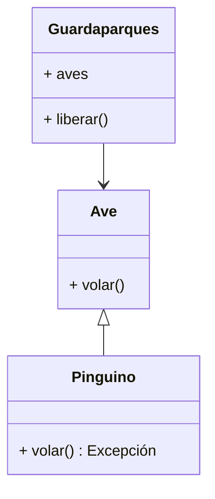

## LSP: Principio de sustitución de Liskov

Imaginemos que nos encontramos en el siglo XIX en los albores de la electricidad, la gente dejaba de usar velas y las reemplazaba por bombillos eléctricos, seguramente la gente esperaba que iluminará mejor o al menos de la misma manera que las velas. 
Este principio está relacionado con cambiar cosas y que se espera con los cambios. Además nos ayuda a evitar errores inesperados cuando usa herencia y polimorfismo en el código.

Es la **L** en SOLID y viene del ingles "Liskov Substitution Principle" o LCP.

En 1988, Barbara Liskov formuló la siguiente propiedad de sustitución:

{: .box-success} 
si para cada objeto o1 de tipo **S** hay un objeto o2 de tipo **T** tal que para todos los programas P definidos en términos de **T**, el comportamiento de P no cambia cuando se sustituye o1 para o2 entonces **S** es un *subtipo* de **T**.

En esta definición tenemos el tipo T también llamado **tipo base** el cual tiene métodos que pueden ser anulados por el subtipo.

Tenemos el **subtipo** S que es una clase que hereda del tipo T, 
Además al invocar el programa no van a saber, y no deberían saberlo, que subtipo están invocando. 
Esto se debe a que el comportamiento del programa no debe cambiar tanto haciendo uso de T o de S.

### Reglas del contrato de Liskov

Hay varias "reglas" que se deben seguir para cumplir con el LSP. 
Estas reglas se pueden dividir en dos categorías: **reglas de contrato** (relacionadas con las expectativas de las clases) y **reglas de variación** (relacionadas con los tipos que se pueden sustituir en el código).

#### Reglas del contrato

Estas reglas se relacionan con el contrato del supertipo y las restricciones impuestas a los contratos que se pueden agregar al subtipo.

* Las condiciones previas no se pueden reforzar en un subtipo.
* Las poscondiciones no se pueden debilitar en un subtipo.
* Las invariantes del supertipo deben conservarse en un subtipo.

#### Reglas de variación

Estas reglas se relacionan con la variación de argumentos y tipos de retorno.

* Debe haber contravarianza de los argumentos del método en el subtipo.
* Debe haber covarianza de los tipos de devolución en el subtipo.
* El subtipo no puede generar nuevas excepciones a menos que formen parte de la jerarquía de excepciones existente.

En este blog no voy a entrar en detalle en estás reglas (Seguramente dedicaré uno exclusivos a ellas) pero básicamente nos indican que el comportamiento y la compatibilidad se debe mantener luego de la sustitución de la clase.

### Ejemplo de violación del principio LSP

Veamos el siguiente diagrama de clases:

Veamos la clase Pinguino que es un subtipo de Ave:

~~~
public class Ave {
    public void volar() {
        System.out.println("Volando");
    }
}

public class Pinguino extends Ave {
    public void volar() {
        throw new UnsupportedOperationException("Pum! Los pinguinos no pueden volar");
    }
}
~~~

Los pingüinos son de la familia de las aves pero lamentablemente no vuelan, es por eso que lanza una excepción al intentar volar.

Ahora imaginemos que tenemos un cliente que depende de Ave en este caso una clase Guardaparques

~~~
import java.util.List;

public class Guardaparques {
    public List<Ave> aves;

    public Guardaparques(List<Ave> aves) {
        this.aves = aves;
    }

    public void liberarAves() {
        for (Ave ave : aves) {
            ave.volar();
        }
    }
}

~~~

Ahora creamos una instancia y veamos que pasa:
~~~
import java.util.List;

public class App {
    public static void main(String[] args) {
        Guardaparques guarda = new Guardaparques(List.of(new Ave(), new Pinguino()));
        guarda.liberarAves();
    }
}

~~~

Esta incialización de la clase Guardaparques es correcta con una colección de aves. Pero al ejecutarla nos arroja la siguiente excepción
~~~
Exception in thread "main" java.lang.UnsupportedOperationException: Pum! Los pingüinos no pueden volar
~~~

Esto se debe a que la clase pingüino rompe con una regla de variación ya que introduce una excepción que no es propia en Ave. Y la clase Guardaparques no tiene porque estar al tanto de ese cambio. Lo cual viola el LSP.

Para finalizar, este principio no solo se aplica a clases si no que hace referencia a los contratos pactados a través de las interfaces y estas pueden tener muchas formas como por ejemplo interfaces de APIs REST por lo que puede generalizarse a nivel de arquitectura ya que una violacion de compatibilidad puede contaminar los mecanismos de esa arquitectura.

