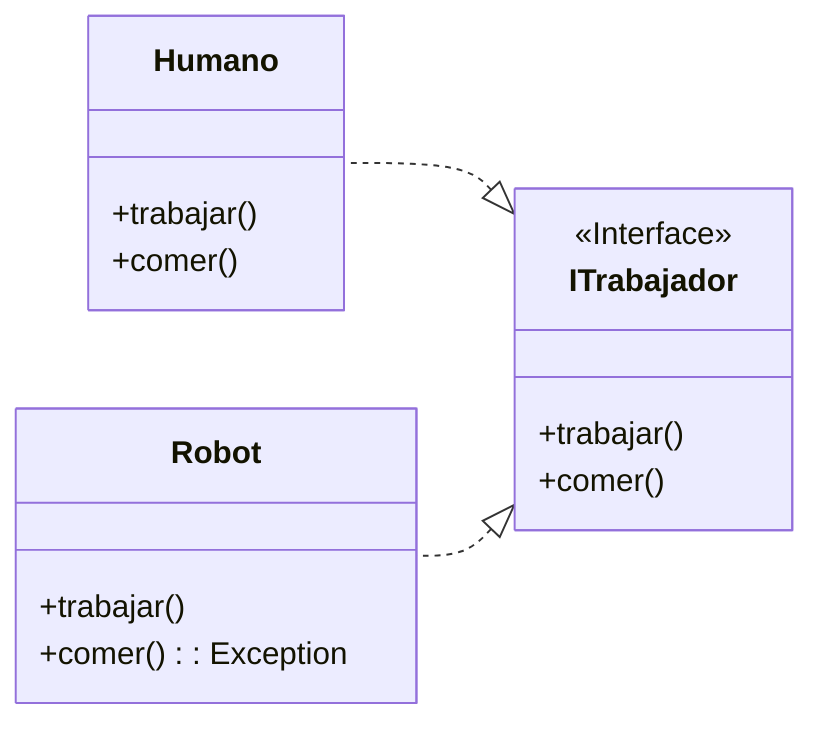

## ISP: Principio de Segregación de Interfaces


El Interface Segregation Principle (ISP), o en español, Principio de Segregación de Interfaces, se centra en cómo deben diseñarse las interfaces en la programación orientada a objetos.

La frase que resume este principio es:

{: .box-success}
Ningún cliente debería estar forzado a depender de métodos que no usa.

En otras palabras, las interfaces deben ser específicas y pequeñas, evitando tener interfaces monolíticas que obliguen a las clases que las implementan a depender de métodos innecesarios.

### Ejemplo de ISP

Supongamos que queremos modelar un sistema de trabajo que involucra tanto a humanos como a robots. Para ello, usamos una interfaz que actúa como contrato con dos acciones o métodos: trabajar y comer.



#### Problema del Diseño Actual

En este caso, un robot al intentar ejecutar el método `comer` debería arrojar un error, ya que esta acción no es relevante para él. Este diseño presenta varios problemas:
- **Dependencias Innecesarias**: La clase `Robot` tiene que implementar un método que no necesita, lo cual es una dependencia innecesaria.
- **Falta de Flexibilidad**: Esto restringe la flexibilidad del diseño, ya que obliga a las clases a implementar métodos irrelevantes.
- **Mantenimiento Complicado**: Puede generar problemas de mantenimiento en el futuro, ya que las clases están obligadas a manejar métodos innecesarios.


#### Solución mediante Segregación de Interfaces

Este problema se puede resolver segregando las operaciones en interfaces específicas, como se muestra en el siguiente diagrama de clases:


 ```mermaid
classDiagram
    direction RL
    ITrabajador <|.. Humano
    INutricion <|.. Humano
    ITrabajador <|.. Robot

    <<Interface>> ITrabajador
    class ITrabajador{
        +trabajar()
    }

    <<Interface>> INutricion
    class INutricion{
        +comer()
    }

    class Humano{
        +trabajar()
        +comer()
    }

    class Robot{
        +trabajar()
    }
```

Esta segregación asegura que la clase `Robot` solo dependa de la interfaz correspondiente a su operación necesaria, que en este caso es `trabajar`. De este modo, cualquier cambio en el método `comer` no afectará a la clase `Robot`, mejorando así la flexibilidad y el mantenimiento del código.


### ISP y los lenguajes

El Principio de Segregación de Interfaces (ISP) tiene una relación significativa con los lenguajes de programación tipados, particularmente aquellos que son fuertemente y estáticamente tipados como Java, C# y otros similares. 
En estos lenguajes, se obliga a los programadores a realizar declaraciones explícitas de interfaces, lo que puede crear dependencias en el código y permitir la verificación en tiempo de compilación. Este enfoque asegura que las clases implementen solo los métodos que necesitan, alineándose con el ISP y mejorando la mantenibilidad y escalabilidad del código.


Por otro lado, en lenguajes dinámicamente tipados como Python, los tipos y las interfaces no se verifican hasta el tiempo de ejecución. Esto significa que la violación de principios como el ISP solo se detectará cuando el código se ejecute, haciendo que los errores sean menos predecibles y más difíciles de rastrear. 
Sin embargo, aplicar el ISP sigue siendo crucial para mejorar la claridad del código, reducir dependencias innecesarias y facilitar su mantenimiento, incluso en un entorno dinámico.
