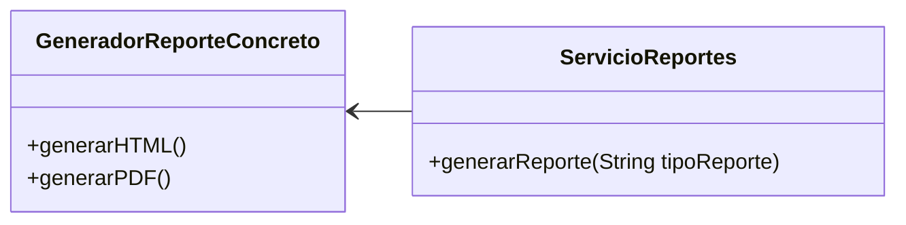
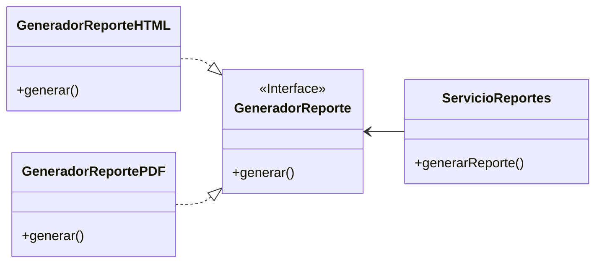

## DIP: Principio de Inversión de la Dependencia

El Principio de Inversión de la Dependencia (Dependency Inversion Principle, DIP) se sustenta en dos pilares esenciales:

{: .box-success}
1) Los módulos de alto nivel no deben depender directamente de los módulos de bajo nivel. Ambos deben depender de abstracciones.

{: .box-success}
2) Las abstracciones no deben depender de detalles concretos. Los detalles deben depender de las abstracciones.

En pocas palabras, este principio nos indica que los sistemas más flexibles son aquellos en los que las dependencias se establecen en base a abstracciones, en lugar de depender directamente de implementaciones concretas.

Sin embargo, aplicar esta idea de forma rígida como una regla inflexible no es realista, ya que en los sistemas de software es inevitable depender de algunas implementaciones concretas. Por ejemplo, la clase `String` en Java es una implementación concreta y no sería práctico ni necesario convertirla en una abstracción. 

La razón por la cual la dependencia de esta clase concreta, `String`, no representa un problema radica en su estabilidad. Los cambios en esta clase son extremadamente raros y están estrictamente controlados. Esto evita que los programadores y arquitectos se vean preocupados por cambios imprevistos o frecuentes en dicha clase. 
Esta estabilidad es lo que hace que las dependencias en ciertas clases concretas sean aceptables en un contexto bien controlado.

Otro concepto crucial y relacionado es el que los GOF nos presentaron en su libro "Design Patterns: Elements of Reusable Object-Oriented Software":

{: .box-success}
Programa para una interfaz, no para una implementación.

Existen dos beneficios principales al manejar objetos únicamente a través de la interfaz definida por las clases abstractas:

1. Los clientes no necesitan saber los tipos específicos de objetos que utilizan, siempre y cuando los objetos sigan la interfaz que los clientes esperan.
2. Los clientes no necesitan conocer las clases que implementan esos objetos. Los clientes solo requieren conocimiento de la clase abstracta que define la interfaz.

Cada cambio en una interfaz abstracta conlleva un cambio en sus implementaciones concretas. Por otro lado, los cambios en las implementaciones concretas no siempre, ni siquiera comúnmente, requieren modificaciones en las interfaces que implementan. Por lo tanto, las interfaces son menos propensas a cambios que las implementaciones.

La implicación principal es que las arquitecturas de software estables son aquellas que evitan depender de concreciones volátiles y que favorecen el uso de interfaces abstractas estables. Esta implicación se traduce en un conjunto específico de prácticas de codificación:

* **Evitar hacer referencia a clases concretas volátiles.** En su lugar, utilizar interfaces abstractas. Esta regla aplica en todos los lenguajes de programación, ya sea de tipado estático o dinámico. Además, establece restricciones significativas en la creación de objetos y promueve el uso de Abstract Factories.

* **Evitar heredar de clases concretas volátiles.** Esto es una extensión de la regla anterior, pero es importante mencionarlo por separado. En los lenguajes de tipado estático, la herencia es la relación más fuerte y rígida del código fuente; por lo tanto, debe usarse con precaución. En los lenguajes de tipado dinámico, la herencia es menos problemática, pero sigue siendo una forma de dependencia y debe manejarse con cuidado.

* **Evitar anular funciones concretas.** Las funciones concretas a menudo generan dependencias en el código fuente. Al anular esas funciones, no se eliminan esas dependencias; de hecho, se heredan. Para manejar esas dependencias, es necesario convertir la función en abstracta y crear múltiples implementaciones.

### Ejemplo

Supongamos que debemos diseñar un sistema que genere informes en diversos formatos, como PDF o HTML. 
Para abordar esta necesidad, podemos contemplar la creación de un servicio denominado `ServicioReportes`, el cual se encargaría de generar los informes al recibir como parámetro el tipo de reporte deseado. Este servicio invocaría el método correspondiente en la clase `GeneradorReporteConcreto`. 

Genial! con esta solución, logramos satisfacer los requisitos planteados. A continuación, se presenta el diagrama de clases correspondiente:

Ahora, consideremos el escenario en el que necesitamos incorporar un nuevo tipo de informe al sistema. Esta tarea implicaría la necesidad de modificar el código dentro de `ServicioReportes` transpasando su frontera, lo cual revelaría una dependencia hacia un código que puede cambiar frecuentemente. Para evitar este tipo de situación, una solución sería implementar una interfaz (consultar el ISP) y establecer que `ServicioReportes` dependa de la interfaz `GeneradorReporte`.
El nuevo diagrama de clases se presentaría de la siguiente manera:

Veamos como quedaría la solución en código Java:

~~~~
public class App {
    public static void main(String[] args) {
        GeneradorReporte generadorReportePDF = new GeneradorReportePDF();
        ServicioReportes pdfServicioReportes = new ServicioReportes(generadorReportePDF);
        pdfServicioReportes.generarReporte();

        GeneradorReporte generadorReporteHTML = new GeneradorReporteHTML();
        ServicioReportes csvServicioReportes = new ServicioReportes(generadorReporteHTML);
        csvServicioReportes.generarReporte();
    }
}

// Clase de negocio que depende de la generación de reportes
class ServicioReportes {
    private final GeneradorReporte generadorReporte;

    public ServicioReportes(GeneradorReporte generadorReporte) {
        this.generadorReporte = generadorReporte;
    }

    public void generarReporte() {
        generadorReporte.generar();
    }
}

interface GeneradorReporte {
    void generar();
}

// Clase concreta que implementa la interfaz GeneradorReporte para generar reportes en formato HTML
class GeneradorReporteHTML implements GeneradorReporte {
    @Override
    public void generar() {
        System.out.println("Generando un reporte en formato HTML...");
    }
}

// Clase concreta que implementa la interfaz GeneradorReporte para generar reportes en formato PDF
class GeneradorReportePDF implements GeneradorReporte {
    @Override
    public void generar() {
        System.out.println("Generando un reporte en formato PDF...");
    }
}
~~~~

Si tuvieramos que agregar otro tipo de reporte, simplemente agregariamos una nueva clase concreta que implemente `GeneradorReporte` y pasariamos esta instancia al constructor de `ServicioReportes`.

Como nota en relación a este fragmento de código:
~~~JAVA
    GeneradorReporte generadorReportePDF = new GeneradorReportePDF();
    ServicioReportes pdfServicioReportes = new ServicioReportes(generadorReportePDF);
~~~

Se observa que `ServicioReportes` recibe una instancia a través de su constructor. Esta técnica se conoce como **Inyección de constructores**.

### Beneficios de DIP

La implementación del _Principio de Inversión de la Dependencia_ (DIP) mejora la flexibilidad y mantenibilidad del software al reducir las dependencias en implementaciones concretas y fomentar el uso de abstracciones. Aunque no todas las dependencias pueden ser abstractas, el objetivo es minimizar las dependencias concretas, salvo en casos donde se garantice la estabilidad. Se busca evitar depender de elementos concretos volátiles en nuestro sistema, lo que nos permite desarrollar un código con bajo acoplamiento.

### Fábricas

Para cumplir con este principio la creación de objetos concretos volátiles requiere un tratamiento especial. Esta precaución se justifica porque, en la mayoría de los lenguajes de programación, la creación de un objeto implica una dependencia del código fuente de la definición concreta de ese objeto.

En la mayoría de los lenguajes orientados a objetos, como Java, se utiliza comúnmente una fábrica abstracta para gestionar esta dependencia indeseable (Tema que dejaré para otro Post específico).

### Patrón de Inyección de Dependencias

El _Principio de Inversión de la Dependencia_ se implementa habitualmente mediante el uso de patrones de diseño como la **Inversión de Control** (IoC) y la **Inyección de Dependencias** (DI). Estos patrones ofrecen mecanismos para que las dependencias sean inyectadas en los objetos, en lugar de permitir que los objetos creen sus propias dependencias.

Mucha gente se refiere a la la _Inyección de Dependencias_ (DI) como _Inversión de Control_ (IoC) (también conocido como el _Principio de Hollywood_ - "No nos llames, te llamaremos"). 
Estos dos términos a veces se usan indistintamente, pero **DI es un subconjunto de IoC**.
