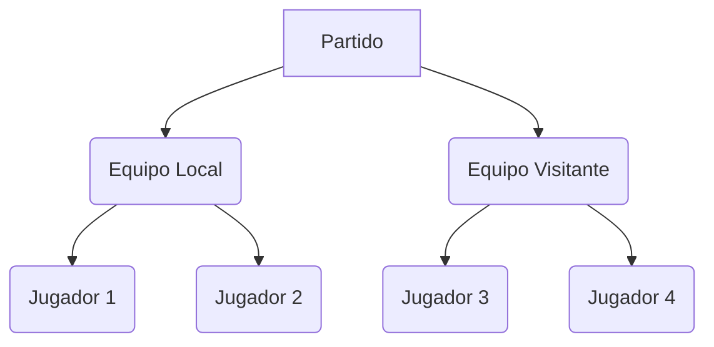

## Combinación de Patrones: Composite + Iterator

{: .mx-auto.d-block :}

Imaginemos que la FIFA nos solicita desarrollar un sistema para registrar partidos de fútbol. La estructura es sencilla: cada partido involucra un equipo local y un equipo visitante. Cada uno de estos equipos está compuesto por varios jugadores. Los jugadores son responsables de marcar goles.

El sistema proporcionará información sobre la fecha del partido, junto con la cantidad de goles anotados por cada equipo. Además, ofrecerá un resumen detallado de los goles marcados por cada jugador.

Podemos verlo graficamente de la siguiente manera:

Ahora el patrón de diseño Composite es un patrón estructural que te permite componer objetos en estructuras de árbol para representar jerarquías. Este patrón nos viene perfecto para representar la estructura Partido -> Equipo -> Jugador.
Pero ahora tenemos el problema que debemos mostrar tanto los goles de los equipos y el de los jugadores. Aqui es donde entra en juego el patrón Iterator.
El patrón de diseño Iterator es un patrón de comportamiento que proporciona una manera de acceder secuencialmente a los elementos de un objeto sin revelar detalles internos de su estructura. Este patrón es útil cuando necesitas recorrer una colección compleja como la que tenemos en este caso y no queremos que su complejidad sea visible para el cliente.

### Código de Ejemplo

#### Composite

Esta interfaz está destinada a proporcionar un contrato para obtener estadísticas relacionadas con un equipo o jugador de fútbol.  

La interfaz contiene un único método, `obtenerGoles`, que se espera que devuelva un entero que representa el número de goles. Es la acción que se va a realizar en el composite.

~~~
public interface Estadisticas {
  int obtenerGoles();
}
~~~

#### Modelos

La clase `Jugador` representa a un jugador de fútbol con atributos para el nombre del jugador y el número de goles que ha marcado. Incluye un constructor para inicializar estos atributos.
Al implementar el metodo `obtenerGoles` estamos indicando que esta clase sera parte de la estructura de arbol del composite.

~~~
public class Jugador implements Estadisticas {
  private final String nombre;
  private final int goles;

  public Jugador(String nombre, int goles) {
    this.nombre = nombre;
    this.goles = goles;
  }

  public String getNombre() {
    return nombre;
  }

  @Override
  public int obtenerGoles() {
    return goles;
  }
}
~~~

La clase `Equipo` representa un equipo de fútbol. Tiene un nombre y una lista de jugadores (`jugadores`). 

La clase proporciona métodos para agregar un jugador al equipo, obtener el nombre del equipo y calcular el número total de goles marcados por todos los jugadores del equipo. De igual manera que Jugador al implementar el metodo `obtenerGoles` estamos indicando que esta clase sera parte de la estructura de arbol del composite.

También implementa la interfaz `Iterable`, permitiendo la iteración sobre sus jugadores usando un iterador personalizado (`TeamIterator`).

~~~
public class Equipo implements Iterable<Jugador>, Estadisticas {
  private final String nombre;
  private final List<Jugador> jugadores;

  public Equipo(String nombreEquipo) {
    this.nombre = nombreEquipo;
    this.jugadores = new ArrayList<>();
  }

  public void agregarJugador(Jugador jugador) {
    jugadores.add(jugador);
  }

  public String getNombre() {
    return nombre;
  }

  @Override
  public Iterator<Jugador> iterator() {
    return new IteradorEquipo(jugadores);
  }

  /**
   * Calcula la cantidad total de goles del equipo.
   * Delega el cálculo a cada jugador y suma los goles de todos los jugadores.
   * @return La cantidad total de goles del equipo.
   */
  @Override
  public int obtenerGoles() {
    int total = 0;
    for (Jugador jugador : jugadores) {
      total += jugador.obtenerGoles();
    }
    return total;
  }
}
~~~

#### Iterator

La clase `IteradorEquipo` implementa la interfaz Iterator para la clase Jugador. Permite iterar sobre la lista de jugadores en un equipo. 

El método hasNext comprueba si hay más jugadores para iterar y el método next devuelve al siguiente jugador en la lista.

Notar que aqui hacemos uso de la interfaz `Iterator` que nos provee Java con el paquete `java.util` para no tener que crear este simple contrato.

~~~
public class IteradorEquipo implements Iterator<Jugador> {
  private List<Jugador> jugadores;
  private int contador;

  public IteradorEquipo(List<Jugador> jugadores) {
    this.jugadores = jugadores;
    this.contador = 0;
  }

  @Override
  public boolean hasNext() {
    return contador < jugadores.size();
  }

  @Override
  public Jugador next() {
    if (!hasNext()) {
      throw new IndexOutOfBoundsException("No hay más jugadores para iterar.");
    }
    return jugadores.get(contador++);
  }
}
~~~

La clase `Partido` representa un enfrentamiento entre dos equipos. Almacena la fecha del partido y referencias al equipo local (`equipoLocal`) y al equipo visitante (`equipoVisitante`). 

La clase implementa la interfaz `Iterable` para permitir la iteración sobre todos los jugadores de ambos equipos combinados. 

También incluye un método para mostrar un resumen del partido, incluyendo los goles totales de cada equipo y los detalles de cada jugado

~~~
public class Partido implements Iterable<Jugador> {
  private final String fecha;
  private Equipo equipoLocal;
  private Equipo equipoVisitante;

  public Partido(Equipo equipoLocal, Equipo equipoVisitante, String fecha) {
    this.fecha = fecha;
    this.equipoLocal = equipoLocal;
    this.equipoVisitante = equipoVisitante;
  }

  @Override
  public Iterator<Jugador> iterator() {
    // Retornar un iterador combinado de ambos equipos.
    List<Jugador> todosJugadores = new ArrayList<>();
    for (Jugador jugador : equipoLocal) {
      todosJugadores.add(jugador);
    }
    for (Jugador jugador : equipoVisitante) {
      todosJugadores.add(jugador);
    }

    return todosJugadores.iterator();
  }

  // Método para calcular los goles totales del partido
  public void mostrarResumen() {
    System.out.println("Resumen del Partido - Fecha: " + fecha);
    System.out.println(equipoLocal.getNombre() + " tiene " + equipoLocal.obtenerGoles() + " goles.");
    System.out.println(equipoVisitante.getNombre() + " tiene " + equipoVisitante.obtenerGoles() + " goles.");

    System.out.println("\nJugadores en el partido:");

    // Usamos el iterador para mostrar todos los jugadores en el partido.
    for (Jugador jugador : this) {
      System.out.println(" * " + jugador.getNombre() + " - Goles: " + jugador.obtenerGoles());
    }
  }
}
~~~

#### Integración de Patrones

#### Clase Principal: `Main`

Primero, el código crea instancias de la clase Jugador para representar a cuatro jugadores de fútbol: Lionel Messi, Ángel Di María, Kylian Mbappé y Ousmane Dembélé. Cada jugador se inicializa con su nombre y el número de goles que han marcado.
A continuación, el código crea dos instancias de la clase Equipo para representar a los equipos Argentina y Francia.

~~~
public class Main {
  public static void main(String[] args) {
    // Crear algunos jugadores
    Jugador messi = new Jugador("Lionel Messi", 2);
    Jugador diMaria = new Jugador("Ángel Di María", 1);

    Jugador mbappe = new Jugador("Kylian Mbappé", 3);
    Jugador dembele = new Jugador("Ousmane Dembélé", 0);

    // Crear equipos y agregar jugadores
    Equipo argentina = new Equipo("Argentina");
    argentina.addJugador(messi);
    argentina.addJugador(diMaria);

    Equipo francia = new Equipo("Francia");
    francia.addJugador(mbappe);
    francia.addJugador(dembele);

    // Crear un partido entre los dos equipos y mostrar resumen del mismo.
    Partido partido = new Partido(argentina, francia, "18 de diciembre de 2022");

    partido.mostrarResumen();
  }
}
~~~

Finalmente, se crea una instancia de Partido para representar la final de la copa delmundo, partido entre Argentina y Francia programado para el 18 de diciembre de 2022. 

Se llama al método mostrarResumen para mostrar un resumen del partido, incluyendo los goles totales de cada equipo y los detalles de cada jugador

### Ejecución del Código

Al ejecutar el código anterior, obtendremos la siguiente salida:

~~~~
Resumen del Partido - Fecha: 18 de diciembre de 2022
Argentina tiene 3 goles.
Francia tiene 3 goles.

Jugadores en el partido:
 * Lionel Messi - Goles: 2
 * Ángel Di María - Goles: 1
 * Kylian Mbappé - Goles: 3
 * Ousmane Dembélé - Goles: 0
~~~~

### Análisis final de este Combo

Combinar los patrones de diseño Composite e Iterator es una estrategia poderosa para manejar estructuras de datos jerárquicas complejas y facilitar su recorrido y nos permite separar las preocupaciones de composición y de iteración.
