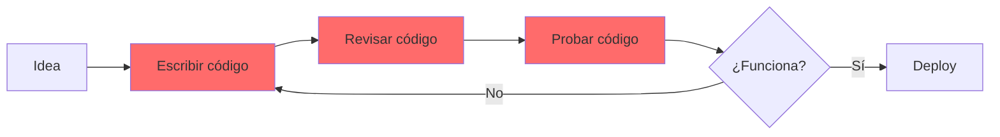
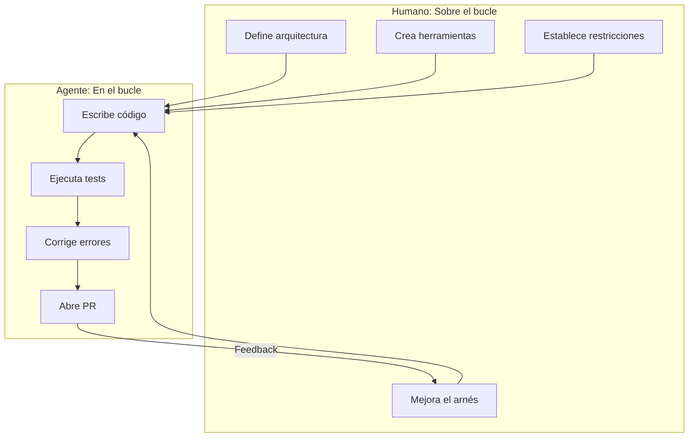
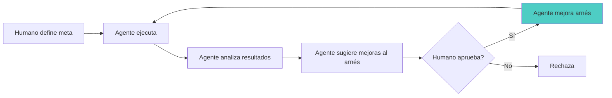

{: .mx-auto.d-block :}

Imaginá que tu trabajo como desarrollador ya no es escribir código línea por línea, sino diseñar el entorno en el que
un agente de IA escribe ese código por vos. Suena a ciencia ficción, ¿no? Pero esto ya está pasando. Un equipo de OpenAI
construyó un millón de líneas de código en 5 meses con una regla estricta: **cero líneas escritas manualmente**. T
odo fue generado por agentes de IA.

¿Cómo lo lograron? Con algo llamado **Ingeniería del Arnés** o *Harness Engineering*. Y no, no se trata simplemente de
pedirle a ChatGPT que te genere funciones. Es mucho más profundo que eso.

En este post vamos a explorar qué es la Ingeniería del Arnés, por qué cambia radicalmente el rol del desarrollador, y
cómo podés empezar a pensar en estos términos aunque hoy estés escribiendo código "a mano".

## El gran cambio de mentalidad: De "en el bucle" a "sobre el bucle"

Para entender la Ingeniería del Arnés, primero tenemos que entender un cambio conceptual fundamental. Tradicionalmente,
los desarrolladores trabajamos **en el bucle**: escribimos código, lo revisamos, lo corregimos, lo probamos. Estamos
metidos en cada detalle de la implementación.



Con los agentes de IA, el paradigma cambia. Los humanos dejan de estar **en el bucle** (revisando cada línea) para
trabajar **sobre el bucle** (diseñando el entorno que permite que el agente produzca buen código de forma autónoma).



### La regla de oro: No corrijas el código, corregí el arnés

Acá viene lo más contraintuitivo. Cuando un agente falla y genera código malo, **la tentación es entrar a editarlo manualmente**.
Pero eso es volver al modelo viejo. En cambio, un ingeniero del arnés se pregunta:

{: .box-warning}
**"¿Qué le falta al agente para que pueda resolver esto por sí mismo?"**

¿Le falta documentación? ¿Le falta una herramienta? ¿Las restricciones arquitectónicas no están claras? El foco cambia de "arreglar este bug" a "mejorar el sistema para que el agente no cometa este tipo de bug nunca más".

Es como la diferencia entre darle un pescado a alguien o enseñarle a pescar. Pero llevado al extremo: estás construyendo la caña de pescar, el estanque y las instrucciones para que el agente pesque solo.

## Los tres pilares de un buen arnés

Según el análisis de Thoughtworks del experimento de OpenAI, un arnés efectivo se apoya en tres pilares complementarios:

### 1. Ingeniería de Contexto: El mapa, no el manual

¿Alguna vez intentaste darle a un modelo de IA un documento gigante con todas las reglas y especificaciones del proyecto? ¿Y viste cómo se pierde, ignora partes, o se contradice?

El primer error común es crear un **AGENTS.md de 1000 líneas** con todo lo que el agente necesita saber. Esto falla porque:

- **El contexto es escaso**: Si llenás la ventana de contexto con un manual enorme, no queda espacio para el código real.
- **Todo importante = nada importante**: Cuando todo está marcado como crucial, el agente no sabe qué priorizar.
- **Se pudre instantáneamente**: Un documento monolítico se vuelve obsoleto al toque y es imposible de mantener.

{: .box-success}
**La solución**: Tratá a `AGENTS.md` como un **índice corto** (100 líneas aprox) que apunta a una base de conocimientos estructurada en el repositorio.

```
AGENTS.md (el mapa, ~100 líneas)
ARCHITECTURE.md
docs/
├── design-docs/
│   ├── index.md
│   ├── core-beliefs.md
│   └── ...
├── exec-plans/
│   ├── active/
│   ├── completed/
│   └── tech-debt-tracker.md
├── product-specs/
├── references/
├── DESIGN.md
├── FRONTEND.md
└── SECURITY.md
```

El agente empieza con el mapa y aprende **dónde buscar** la información que necesita en cada momento, en lugar de ser bombardeado con todo desde el inicio.

Además, el contexto no es solo documentación estática. En el experimento de OpenAI, los agentes tenían acceso a:

- **Logs y métricas** (LogQL, PromQL) para entender qué está pasando en runtime
- **Navegación por browser** (Chrome DevTools Protocol) para validar UI
- **Observabilidad local** para cada worktree aislado

Esto les permitía "ver" el sistema funcionando, como lo haría un desarrollador humano.

### 2. Restricciones Arquitectónicas Deterministas: Los guardarraíles

Acá viene algo que suena contradictorio: para que los agentes tengan **más autonomía**, necesitamos **más restricciones**.

¿Por qué? Porque sin restricciones, un agente puede generar código que "funciona" pero que es un caos arquitectónico. Puede mezclar capas, saltarse validaciones, o crear dependencias circulares. Y con un millón de líneas de código, ese caos se vuelve inmanejable rápido.

{: .box-success}
**La solución**: Restricciones arquitectónicas rígidas, forzadas mecánicamente.

El equipo de OpenAI implementó un modelo de arquitectura en capas con reglas estrictas:

```
Dominio de negocio (ej: "App Settings")
├── Types → Config → Repo
└── Providers → Service → Runtime → UI

Reglas:
✓ Solo podés depender "hacia adelante" en las capas
✗ No podés saltarte capas
✗ No podés crear dependencias circulares
```

Y estas reglas no son sugerencias en un documento. Son **linters personalizados** y **tests estructurales** que fallan automáticamente si el código las viola.

Por ejemplo, podrían usar herramientas como:
- **Custom ESLint rules** (JavaScript/TypeScript)
- **ArchUnit** (Java)
- **Custom linters generados por IA** (sí, los agentes escriben sus propios guardarraíles)

La clave es: las restricciones están en código ejecutable, no en documentación que el agente puede ignorar.

### 3. Garbage Collection: Limpieza continua del código

Acá está uno de los insights más valiosos del experimento: **los agentes replican patrones existentes, incluso los malos**.

Si tu código tiene una función mal nombrada, el agente va a crear más funciones mal nombradas. Si tenés duplicación, el agente va a duplicar más. Es como la entropía: el desorden tiende a aumentar.

El equipo de OpenAI descubrió que inicialmente pasaban **todos los viernes** (¡20% del tiempo!) limpiando "AI slop" manualmente. Obviamente, eso no escala.

{: .box-success}
**La solución**: Agentes de "garbage collection" que corren periódicamente.

Estos agentes:
- Detectan desviaciones de los patrones deseados
- Identifican documentación obsoleta
- Encuentran código duplicado o inconsistencias
- Abren PRs de refactoring automáticamente

El humano solo revisa y aprueba (o rechaza) estos PRs. La mayoría se automerge si pasan las validaciones.

Esto es como tener **deuda técnica con 0% de interés** en lugar de deuda con interés compuesto. Cada día limpiás un poquito, en lugar de dejar que se acumule por semanas y después tener que dedicar sprints enteros a "limpiar el código".

## Hacer que el software sea "legible" para la IA

Este concepto es fascinante y suena obvio en retrospectiva, pero es fácil pasarlo por alto.

{: .box-warning}
**Para que un agente sea autónomo, tiene que "ver" lo mismo que vería un desarrollador humano.**

Si vos como desarrollador debugeás mirando logs, el agente necesita acceso a logs. Si validás features abriendo el navegador y clickeando, el agente necesita poder hacer eso. Si chequeás métricas en Grafana, el agente necesita acceso a esas métricas.

En el caso de OpenAI:

1. **Cada tarea tiene su propio worktree aislado**: El agente puede levantar una instancia completa de la app para esa tarea específica, con su propia base de datos, logs, y métricas efímeras.

2. **Chrome DevTools Protocol**: El agente puede manejar un browser, tomar screenshots, inspeccionar el DOM, y validar que la UI funcione correctamente.

3. **Observabilidad local**: Logs (LogQL), métricas (PromQL), y traces (TraceQL) disponibles para que el agente query y entienda qué está pasando.

```
Agente recibe tarea: "El botón de login está roto"

1. Reproduce el bug:
   - Levanta la app en un worktree aislado
   - Abre Chrome via DevTools
   - Navega a /login
   - Clickea botón
   - Captura screenshot del error

2. Diagnostica:
   - Revisa logs con LogQL
   - Encuentra el stack trace
   - Identifica el componente roto

3. Implementa fix:
   - Modifica el código
   - Reinicia la app

4. Valida fix:
   - Repite el flujo
   - Captura screenshot funcionando
   - Verifica métricas de performance

5. Abre PR con:
   - Video del bug
   - Video del fix
   - Explicación del cambio
```

Todo esto **sin intervención humana**. El agente cierra el loop completo.

## La evolución: De agente ejecutor a la "Rueda de Paletas"

El modelo más avanzado se llama **"Paddle Wheel"** o Rueda de Paletas (concepto de Kief Morris). Acá el agente no solo ejecuta tareas, sino que **mejora el propio arnés**.



Imaginate esto:

1. El agente nota que muchas tareas fallan porque los tests de UI son lentos.
2. El agente **propone** agregar tests de contract más rápidos en una capa anterior.
3. El agente abre un PR con la mejora al proceso de testing.
4. Un humano lo revisa y lo aprueba.
5. Ahora **todos** los futuros desarrollos usan ese nuevo proceso.

Con el tiempo, podés incluso automatizar la aprobación de ciertos tipos de mejoras con bajo riesgo. Y así el sistema se vuelve **auto-mejorable**.

Es como Machine Learning aplicado al proceso de desarrollo: el sistema aprende de sus errores y optimiza su propio pipeline.

## Caso real: 1 millón de líneas en 5 meses

Hablemos de números concretos del experimento de OpenAI:

- **Equipo**: 3 ingenieros al inicio, 7 al final
- **Duración**: 5 meses (agosto 2025 - enero 2026)
- **Código generado**: ~1,000,000 líneas
- **Pull Requests**: ~1,500 PRs abiertos y mergeados
- **Throughput**: 3.5 PRs por ingeniero por día (y aumentando)
- **Código escrito manualmente**: 0 líneas

{: .box-success}
**Estimación del equipo**: Esto habría tomado **10 veces más tiempo** escribiendo código manualmente.

El producto no fue un demo. Tuvo:
- Usuarios internos diarios
- Testers externos en alpha
- Deploys reales a producción
- Bugs, fixes, features nuevas

Y lo más impresionante: **el humano no está requerido para review**. Muchos PRs se aprueban y mergean con solo validación de agente-a-agente. El humano solo interviene cuando se requiere juicio de negocio o decisiones estratégicas.

## ¿Está tu repositorio listo para agentes?

Antes de que pienses "esto es muy futurista", podés empezar a aplicar algunos principios **hoy**, aunque escribas código manualmente:

### Checklist: ¿Qué tan "agente-ready" está tu repo?

**Contexto y Documentación:**

- [ ] ¿Tenés un archivo README o ARCHITECTURE.md que explica la estructura del proyecto?
- [ ] ¿La documentación vive en el repo o está dispersa en Google Docs/Slack?
- [ ] ¿Un nuevo desarrollador puede entender la arquitectura leyendo el código y docs del repo?

**Restricciones Arquitectónicas:**

- [ ] ¿Tenés linters configurados (ESLint, Pylint, etc.)?
- [ ] ¿Tenés reglas de arquitectura explícitas (capas, boundaries)?
- [ ] ¿Esas reglas están validadas automáticamente en CI?
- [ ] ¿Has considerado tests estructurales (ArchUnit, Dependency Cruiser)?

**Calidad y Mantenibilidad:**

- [ ] ¿Tenés pre-commit hooks para formato/estilo?
- [ ] ¿Tenés análisis estático de código en CI (SonarQube, CodeClimate)?
- [ ] ¿Revisás y limpias deuda técnica regularmente?
- [ ] ¿O la deuda técnica se acumula por meses?

**Legibilidad y Observabilidad:**

- [ ] ¿Un desarrollador puede levantar el proyecto completo en local fácilmente?
- [ ] ¿Tenés logs estructurados y métricas?
- [ ] ¿Los tests son rápidos y confiables?
- [ ] ¿El CI/CD es claro y reproducible?

{: .box-warning}
**Insight clave**: Cualquier cosa que sea difícil para un humano nuevo en el proyecto, va a ser difícil para un agente. Las mejores prácticas de DX (Developer Experience) son también mejores prácticas de AX (Agent Experience).

## El futuro de la profesión: ¿Qué hacemos los desarrolladores?

Esta es la pregunta del millón. Si los agentes escriben el código, ¿qué hacemos nosotros?

El experimento de OpenAI sugiere algunas respuestas:

**Seguimos siendo críticos para:**

1. **Definir el "qué" y el "por qué"**: Los objetivos de negocio, las prioridades, la visión del producto.
2. **Diseñar sistemas y entornos**: La arquitectura de alto nivel, las restricciones, los principios.
3. **Construir herramientas para agentes**: Linters, validaciones, observabilidad.
4. **Tomar decisiones de juicio**: Trade-offs arquitectónicos, decisiones estratégicas.
5. **Validar resultados de alto nivel**: ¿Esto realmente resuelve el problema del usuario?

**Ya no somos críticos para:**

1. Escribir cada línea de código
2. Debuggear cada error
3. Escribir tests boilerplate
4. Configurar CI/CD manualmente
5. Refactorizar código repetitivo

{: .box-success}
La disciplina no desaparece. Se **traslada** del código hacia el andamiaje (scaffolding) y los bucles de retroalimentación.

Citando a Ryan Lopopolo del equipo de OpenAI:

> "Lo que se ha vuelto claro: construir software todavía demanda disciplina, pero la disciplina se muestra más en el andamiaje que en el código. Las herramientas, abstracciones y bucles de retroalimentación que mantienen coherente la base de código son cada vez más importantes."

## ¿Por dónde empezar?

Si esto te voló la cabeza (como a mí cuando lo leí), acá van algunas acciones concretas que podés tomar:

### Esta semana:

1. **Revisá tu pre-commit hook**: ¿Qué tiene? ¿Qué podría tener? (formato, linting, tests rápidos)
2. **Documentá tu arquitectura**: Creá o actualizá un ARCHITECTURE.md básico
3. **Identificá un linter custom**: ¿Hay alguna regla que tu equipo siempre tiene que recordar en code review? Automatizala.

### Este mes:

1. **Experimentá con ArchUnit o similar**: Escribí un test que valide una regla arquitectónica de tu proyecto
2. **Mejorá tu DX**: Hacé que sea más fácil levantar el proyecto en local (Docker Compose, scripts de setup)
3. **Probá AI coding assistants**: GitHub Copilot, Cursor, o Claude Code. No como reemplazo, sino como exploración de cómo trabajan los agentes.

### Este trimestre:

1. **Hacé un "doc gardening" pass**: Limpiá documentación obsoleta, consolidá conocimiento disperso
2. **Agregá structural tests**: Empezá a validar boundaries y capas automáticamente
3. **Pensá en términos de arnés**: La próxima vez que debuggees, preguntate "¿cómo podría un agente haber detectado esto solo?"

## Conclusión: No es magia, es ingeniería de sistemas

La Ingeniería del Arnés no es magia. No es "prompt engineering avanzado". Es **ingeniería de sistemas** aplicada al desarrollo de software con agentes.

Estamos pasando de:
- **"Yo escribo el código"**
- a **"Yo diseño el entorno en el que el código se escribe correctamente de forma autónoma"**

Y la buena noticia es que muchas de las habilidades que ya tenés son transferibles:

- ¿Sabés diseñar arquitecturas? Ahora las diseñás pensando en legibilidad para agentes.
- ¿Sabés escribir tests? Ahora escribís tests estructurales que validan invariantes arquitectónicos.
- ¿Sabés hacer code review? Ahora revisás y mejorás el arnés basándote en feedback de los agentes.

El cambio de paradigma es real, pero no significa que todo lo que aprendiste se vuelve obsoleto. Al contrario: necesitás esas bases más que nunca, pero aplicadas a un nivel de abstracción más alto.

{: .box-success}
**Para reflexionar**: El mejor código es el que no se necesita escribir. Pero alguien tiene que diseñar el sistema que lo evita. Y ese alguien sos vos.

---

{: .box-note}
**Nota de transparencia**: Este post fue redactado con la ayuda de Claude (Sonnet 4.5), un agente de IA de Anthropic. Irónico, ¿no? Un artículo sobre Ingeniería del Arnés, escrito por un agente trabajando dentro de un arnés. La estructura, investigación y síntesis fueron guiadas por mí (Alejandro), pero el agente se encargó de la redacción, los diagramas y la organización del contenido. Practiquemos lo que predicamos.

## Referencias

- [Harness engineering: leveraging Codex in an agent-first world](https://openai.com/index/harness-engineering/) - OpenAI (Febrero 2026)
- [Harness Engineering](https://martinfowler.com/articles/harness-engineering.html) - Birgitta Böckeler, Thoughtworks (Febrero 2026)
- [Humans and Agents in Software Engineering Loops](https://martinfowler.com/articles/engineering-loops.html) - Kief Morris (Marzo 2026)
- [Relocating Rigor](https://chadfowler.com/2026/01/24/relocating-rigor.html) - Chad Fowler (Enero 2026)

---

¿Qué te pareció? ¿Ya estás pensando en cómo mejorar tu "arnés" aunque hoy escribas código manualmente? ¿O te quedaste con dudas sobre cómo aplicar esto a tu contexto? ¡Dejame un comentario!
