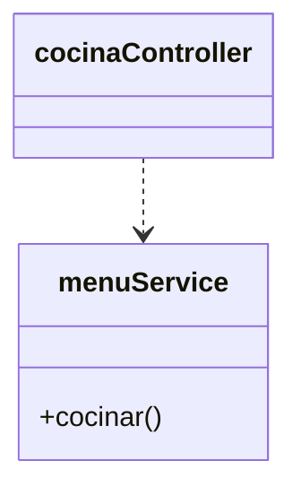
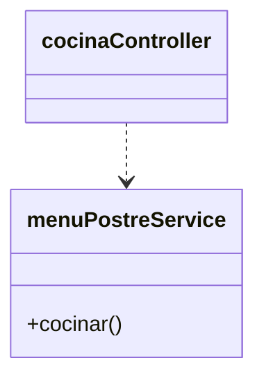
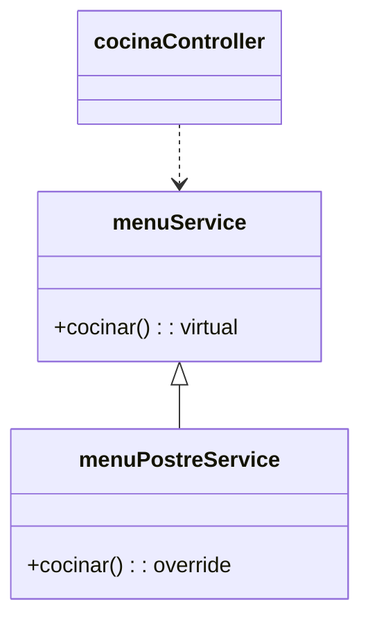
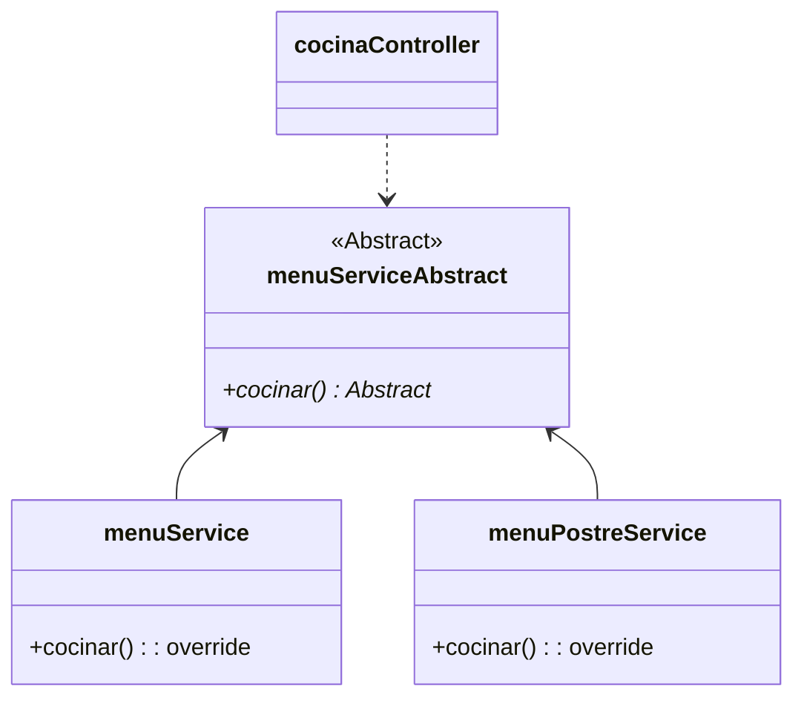

## OCP: Open/Closed principle

Es la **O** en SOLID y viene del ingles "open/closed principle".
Este término fue creado por por Bertrand Meyer en 1988, y definio la regla como:

{: .box-success} 
Un artefacto de software debe estar abierto a la extensión pero cerrado a la modificación.

Esta definición parece ser contradictoria por incluir en la definicion dos cosas opuestas pero que en realidad hacen referencia a distintas cosas. 

### ¿Cómo puede ser algo abierto y cerrado a la vez?

Una segunda defición más clara es la que nos da Robert C. Martin (Desarrollo ágil de software: principios, patrones y prácticas - Prentice Hall, 2003):

{: .box-note}
**“Abierto para extensión”:** Esto significa que el comportamiento del módulo se puede ampliar. A medida que cambian los requisitos de la aplicación, podemos ampliar el módulo con nuevos comportamientos que satisfagan esos cambios. En otras palabras, podemos cambiar lo que hace el módulo.

{: .box-note}
**“Cerrado a modificaciones”:** Ampliar el comportamiento de un módulo no da como resultado cambios en el código fuente o binario del módulo. La versión binaria ejecutable del módulo, ya sea en una biblioteca enlazable, una DLL o un .jar de Java, permanece intacta.

Es decir el código debe tener una naturaleza dual como la luz que se comporta como onda y particula a la vez.
En este caso nuestro código debe cumplir con requisitos y funcionalidades nuevas, y por otro lado aceptar estas funciones minimizando la edición del dódigo existente (Lo ideal es no tener que tocar para nada el código).
Parece imposible, ¿no?.

### ¿Como alcanzar este principio?

Ahora veamos diferentes diseños y analicemos el principio de Abierto/Cerrado en cada caso. 

#### Código sin puntos de extensión

Supongamos que tenemos el siguiente sistema de modela una cocina (*cocinaController*) que depende directamente de la clase encargada de cocinar y prepara los menus (*menuPostreService*), el cúal podemos ver en la siguiente figura:

Ahora supongamos que nuestro lider nos solciita una nueva funcionalidad, en este caso junto con el menú se va a incluir un postre. Entonces pasamos a una segunda version:

En este caso todo el código del nuevo requisito se coloco dentro del método *cocinar* en la clase menuPostreService, por lo que como el controller depende del servicio tendra que actualizar el código también cambiando el nombre de la nueva clase. Es cierto que no es necesario cambiar el nombre de la clase para cambiar el código pero imaginemos que el cambio implique un cambio en la firma del método *concinar* tendriamos el mismo impacto, lo cual no es muy bueno. 
Esto se debe a que con este enfoque de diseño hace que las clases este muy acopladas a las interfaces de sus dependencias.

#### Métodos virtuales

Una implemetación con un punto de extensión es haciendo el método cocinar un metodo virtual.

Este tipo de extensión se llama *herencia de implementación*. Cada lenguaje tiene una manera de implementarlo, en algunos casos es necesario marcar como virtual algunos de los miembros de la clase para que sea abierta a la extensión. 
En el caso de Java se consigue simplemente usando el decorador de método *@Override*.

~~~
public class App {
    public static void main(String[] args) {
        CocinaController cocinaController = new CocinaController();
        cocinaController.hacerPedido();
    }
}

public class CocinaController {
    public void hacerPedido() {
        MenuService service = new MenuPostreService();
        service.cocinar();
    }
}

public class MenuService {
    public void cocinar() {
        System.out.println("Cocinando un menu...");
    }
}

public class MenuPostreService extends menuService {
    public void cocinar() {
        System.out.println("Cocinando un menu y un postre...");
    }
}
~~~

De esta manera hacemos uso del polimorfismo para no tener que modificar el código. Pero tiene algo limitado el alcance de la reimplementacion ya que todavia se puede llamar a MenuService.cocinar()

~~~
public class CocinaController {
    public void hacerPedido() {
        MenuService service = new MenuPostreService();
        service.cocinar();

        service = new MenuService();
        service.cocinar();
    }
}
~~~

Pero de todas maneras nos encontramos en un escenario parecido al anterior en caso de que debas cambiar el comportamiento vas a tener que modificar la clase CocinaController, aunque con un poco más de trabajo en el constructor se puede mejorar un poco el código veamos que otras opciones tenemos.

#### Métodos abstractos

Este diseño genera un punto de extensión más flexible que utiliza la *herencia de implementación* es el *Método Abstracto*.
En el siguiente diagrama vemos que *menuServiceAbstract* es una clase abstracta con un metodo publico cocinar abstracto que es el que se delega a las clases concretas que lo implementen.

