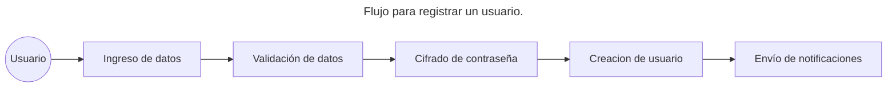
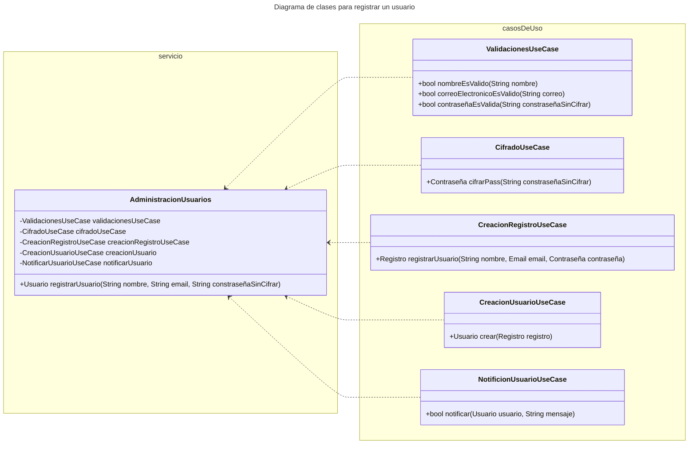
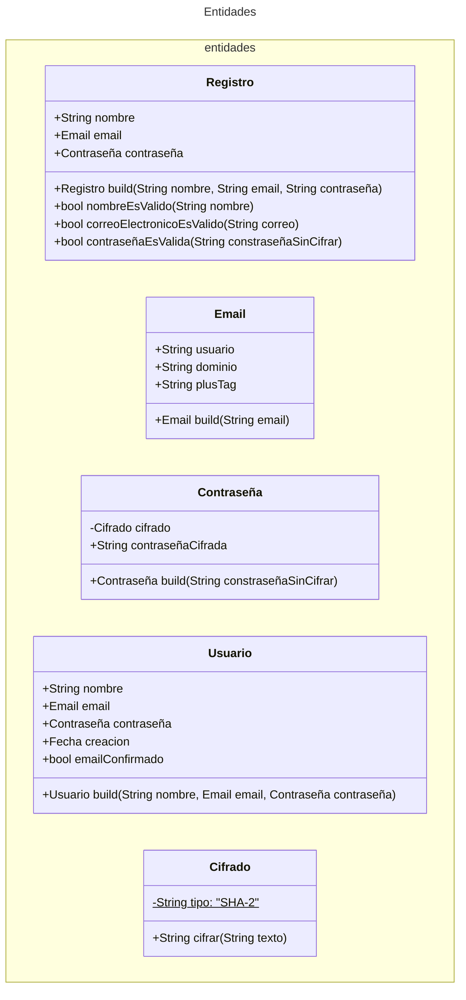

## Casos de uso

{: .mx-auto.d-block :}

**Casos de Uso: Un enfoque clave para el desarrollo de software eficiente y efectivo**

En el mundo del diseño de software, los Casos de Uso son una herramienta fundamental para garantizar que las aplicaciones se desarrollen de manera eficiente y efectiva.

**¿Qué son los Casos de Uso?**

Un Caso de Uso es una definición clara del comportamiento o acción que un usuario puede realizar dentro de un sistema. Se enfoca en la perspectiva del usuario final, identificando las acciones más importantes que pueden tomar dentro del sistema. Los Casos de Uso son la base para el desarrollo de software, ya que nos permiten entender
mejor las necesidades y expectativas del usuario.

### Razones para determinar correctamente los casos de uso

La definición de Casos de Uso ofrece varios beneficios en el desarrollo de software:

*   **Mejora la comprensión del usuario**: Los Casos de Uso nos ayudan a comprender mejor las necesidades y expectativas del usuario final, lo que resulta en un diseño más intuitivo y fácil de usar.

*   **Garantiza un desarrollo eficiente**: Al enfocarnos en las acciones más importantes que el usuario puede realizar, podemos priorizar las funcionalidades más importantes y asegurarnos de que estén bien diseñadas.

*   **Aumenta la calidad del código**: Los Casos de Uso nos ayudan a garantizar que el código sea simple, legible y fácil de mantener.

### Casos de uso segun Clean Architecture y DDD

La arquitectura limpia (Clean Architecture) es un patrón que puede ser aplicado en cualquier diseño de software, mientras que el Diseño dirigido por el dominio (Domain-Driven Design, DDD) es una filosofía más amplia sobre cómo modelar los conceptos empresariales para garantizar que el código refleja realmente los requisitos de la empresa. 

El DDD puede ser aplicado dentro de una arquitectura limpia o en cualquier otra arquitectura de software.

Ambas comparten una visión común sobre la importancia de separar las capas del software en función de su nivel de abstracción. Sin embargo, existen diferencias en la forma en que se aplican estas principios.

En la **arquitectura limpia**, el diseño se centra principalmente en la separación de preocupaciones y la separación lógica de los diferentes niveles de abstracción del software (Entidades, casos de uso, controladores y frameworks), para minimizar las dependencias y mantener el código limpio, simple y fácil de mantener.

En esta arquitectura las reglas del negocio están dentro de la capa de dominio, mientras que las reglas de aplicacion estan dentro de la capa de "Casos de uso". Esto nos da una pista clave de que los casos de uso no son sinonimo de regla de negocio.

En el **DDD**, el diseño se centra en modelar los conceptos empresariales de forma precisa y comprensible, lo que resulta en un modelo de dominio fuerte, independiente del código y capaz de evolucionar independientemente del software. El DDD enfatiza la importancia de colaborar con los stakeholders (expertos en el dominio, arquitectos y desarrolladores) para garantizar que el código refleje realmente los requisitos de la empresa.
En DDD los casos de uso corresponden a los "Application services" o servicios de aplicaciones, son la fachada exterior del dominio de nuestro sistema, por lo que son el punto de entrada-salida para interactuar con la funcionalidad interna. Estos servicios son responsables de controlar el flujo principal de la aplicacion. 
Aqui tenemos la segunda pista clave, los casos de uso deben encargarse del flujo de la aplicacion. 

### Modelando los casos de uso

Ahora veamos un ejemplo flujo clásico que es el de registrar un usuario de una aplicación. Aunque es muy clásico sigue existiendo el debate de cómo modelarlo con casos de usos (O que no se debe modelar). 
Haciéndonos a un lado de este debate es interesante para ver y aprender.

**Requerimientos**

Supongamos que queremos crear un nuevo usuario para el sistema, los requerimientos iniciales que nos dieron son:

* El usuario debe proporcionar los siguientes campos:
    - Nombre: debe tener una longitud máxima de 20 caracteres y no permitir caracteres especiales.
    - Correo electrónico: debe ser único y válido, con soporte para etiquetas y dominios personalizados.
    - Contraseña: Como entrada debe ser una cadena de texto simple (sin encriptación) que se guardará cifrada al momento de crear el usuario.

* Una vez creado el usuario, se enviará una notificación por correo electrónico a la dirección de contacto proporcionada.

**Validaciones**

Las siguientes validaciones deben realizarse para garantizar la integridad del proceso:

* Nombre: solo permite caracteres alfanuméricos y espacios en blanco.
* Correo electrónico: verificar la existencia y validez del dominio, así como el formato de la
dirección de correo electrónico.
* Contraseña: no permitir caracteres especiales o caracteres que no sean letras mayúsculas,
minúsculas, números o guiones.

**Diagrama de Flujos**

Con estos requerimientos ya tenemos suficientes datos para empezar. Siempre es muy útil para diseñar los casos de usos comenzar con un diagrama de flujos.
El siguiente diagrama muestra qué pasos se deben realizar para registrar un usuario:

**Pasos**

1. **Ingreso de datos**: El usuario ingresa su nombre, correo electrónico y contraseña.
2. **Validación de datos**: Se verifican las validaciones de nombre, correo electrónico y contraseña
para asegurarnos de que se cumplan los requisitos.
3. **Cifrado de contraseña**: Si se cumplen las validaciones, el sistema cifra la contraseña para
proteger los datos personales del usuario.
4. **Creacion de usuario**: El sistema guarda el usuario con los datos proporcionados.
5. **Envío de notificaciones**: Se envían las notificaciones al usuario para confirmar su creación y
asegurarse de que se han enviado correctamente.

**Diagrama de clases**

Con estos pasos en mente podemos diseñar el diagrama de clases para los casos de uso.

Por un lado podemos pensar que nuestro punto de entrada a la funcinalidad de resgistro es a traves de un **servicio**.
Este servicio depende de los casos de usos y marca el orden que se deben ir ejecutando y propagando las **entidades** entre ellos.
Tambien nos permite reutilizar funcionalidad como por ejemplo el cifrado o las notificaciones en diferentes partes de nuestro sistema.

En las entidades tenemos la informacion de nuestro dominio de negocio.

Con estas entidades podemos saber por ejemplo cuándo se creó el usuario en el sistema o qué cifrado
estamos utilizando. 
Además, al revisar atentamente el diagrama nos da la pista de que tendremos que
utilizar el patrón Builder para las clases Registro, Email y Usuario.

Para este ejemplo, consideramos las validaciones como casos de uso pero pueden resolverse
dentro del dominio, esto dependerá del enfoque y el grado de enriquecimiento que tomemos para nuestras entidades del sistema. (Ver post [Modelos Anémicos vs. Modelos Enriquecidos](https://memobackend.com.ar/2024-06-11-modelos-anemicos-enriquecidos/)).

### Errores al diseñarlos

Los errores más comunes al desarrollar casos de uso pueden incluir:

1. No tener claridad sobre el propósito del caso de uso y no alinearlo con las necesidades del negocio. Esto puede hacer que los resultados finales no sean lo esperado o no satisfagan a los usuarios.

2. Ignorar el contexto empresarial en el cual opera el sistema y los cambios que pueden ocurrir en el futuro, lo que puede hacer que el caso de uso sea rígido y no adaptable.

3. No tener suficiente abstracción en las interfaces y clases involucradas en la implementación del caso de uso, lo que puede hacer que el código sea dependiente de una tecnología específica o plataforma. Esto hace que el caso de uso no pueda ser reutilizado o transferido a otros entornos sin problemas.

4. No hacer un análisis suficiente y exhaustivo de los casos de uso posibles y sus respectivas implementaciones, lo que puede llevar a fallas de diseño o funcionalidades no deseadas en el sistema.

5. No tener un proceso de pruebas eficaz para garantizar la calidad del código y el comportamiento esperado en todo entorno.

6. No tener suficiente documentación de los casos de uso, lo que puede provocar confusión en los desarrolladores y dificultades para entender el comportamiento del sistema.

### Conclusión

La herramienta clave para el desarrollo de software eficiente y efectivo son los Casos de Uso, ya
que nos permiten enfocarnos en las acciones más importantes que un usuario puede tomar dentro del
sistema, es decir, en el flujo de control de la aplicación. Hemos visto cómo un diagrama de flujo
ayuda a seleccionar los casos de uso básicos que tendremos y pasarlos a un diagrama de clases nos da
indicaciones para llevarlos al código.

Además, esta herramienta nos ayuda a comprender mejor la perspectiva del usuario final y garantizar
sistemas más intuitivos, fáciles de usar y eficientes en el proceso de desarrollo.