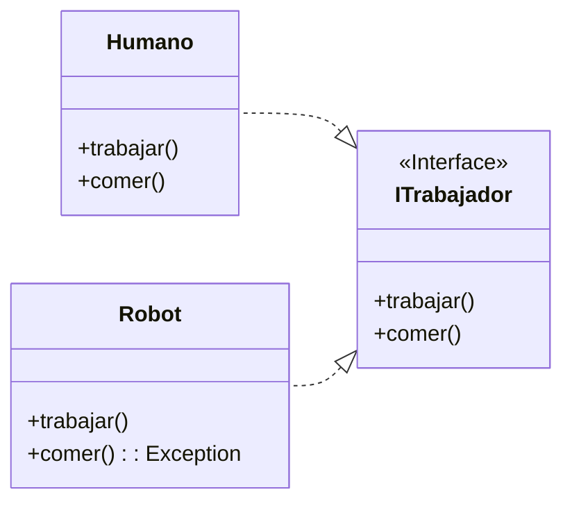

## ISP: Principio de Segregación de Interfaces
El Interface Segregation Principle (ISP), o en español, Principio de Segregación de Interfaces, se centra en cómo deben diseñarse las interfaces en la programación orientada a objetos.

La frase que resume este principio es:

{: .box-success}
Ningún cliente debería estar forzado a depender de métodos que no usa.

En otras palabras, las interfaces deben ser específicas y pequeñas, evitando tener interfaces monolíticas que obliguen a las clases que las implementan a depender de métodos innecesarios.

### Ejemplo de ISP

Supongamos que queremos modelar un sistema de trabajo que involucra tanto a humanos como a robots. Para ello, usamos una interfaz que actúa como contrato con dos acciones o métodos: trabajar y comer.



#### Problema del Diseño Actual

En este caso, un robot al intentar ejecutar el método `comer` debería arrojar un error, ya que esta acción no es relevante para él. Este diseño presenta varios problemas:
- **Dependencias Innecesarias**: La clase `Robot` tiene que implementar un método que no necesita, lo cual es una dependencia innecesaria.
- **Falta de Flexibilidad**: Esto restringe la flexibilidad del diseño, ya que obliga a las clases a implementar métodos irrelevantes.
- **Mantenimiento Complicado**: Puede generar problemas de mantenimiento en el futuro, ya que las clases están obligadas a manejar métodos innecesarios.


#### Solución mediante Segregación de Interfaces

Este problema se puede resolver segregando las operaciones en interfaces específicas, como se muestra en el siguiente diagrama de clases:


 ```mermaid
classDiagram
    direction RL
    ITrabajador <|.. Humano
    INutricion <|.. Humano
    ITrabajador <|.. Robot

    <<Interface>> ITrabajador
    class ITrabajador{
        +trabajar()
    }

    <<Interface>> INutricion
    class INutricion{
        +comer()
    }

    class Humano{
        +trabajar()
        +comer()
    }

    class Robot{
        +trabajar()
    }
```

Esta segregación asegura que la clase `Robot` solo dependa de la interfaz correspondiente a su operación necesaria, que en este caso es `trabajar`. De este modo, cualquier cambio en el método `comer` no afectará a la clase `Robot`, mejorando así la flexibilidad y el mantenimiento del código.
 