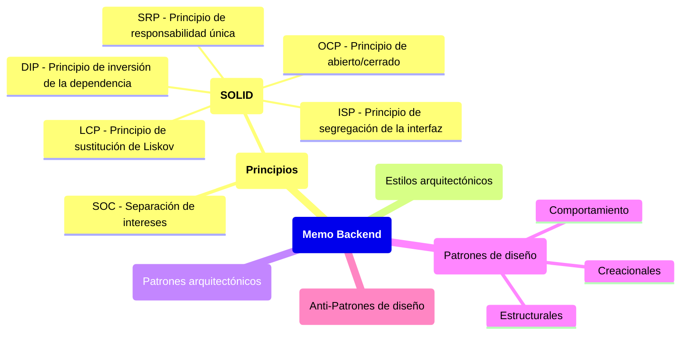
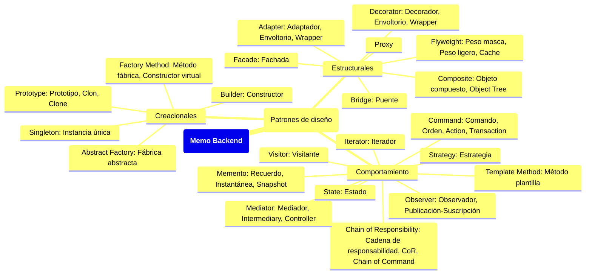
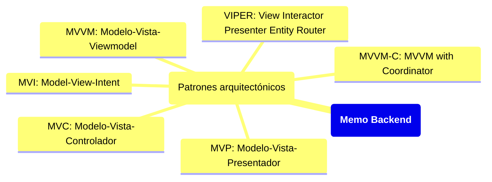
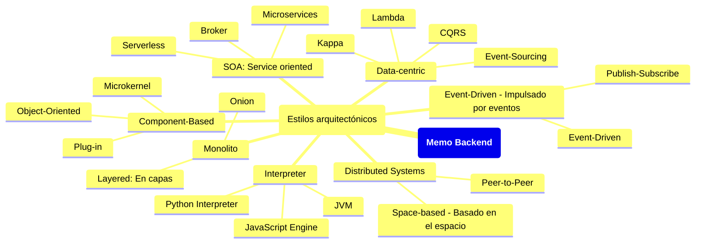
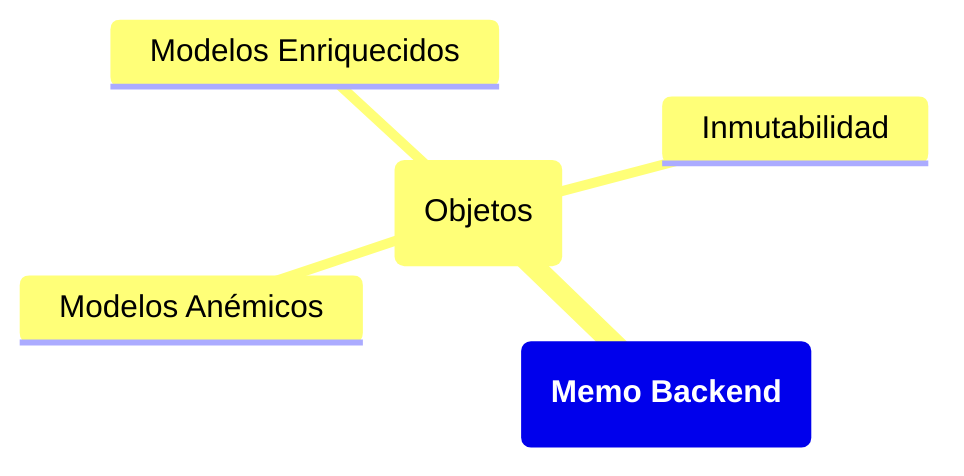
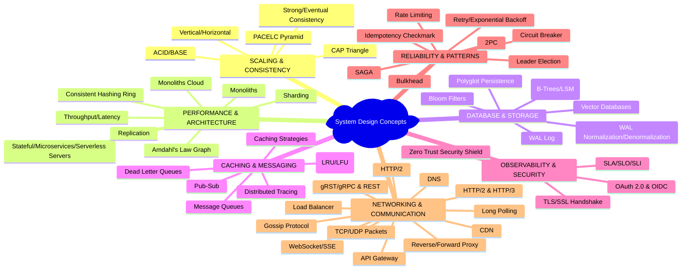

El siguiente gráfico conecta las ideas y los contenidos que podras encontrar próximamente en el sitio:

### Patrones de diseño

### Patrones Arquitectónicos 

### Estilos Arquitectónicos

### Objetos

### Conceptos del diseño de sistemas

