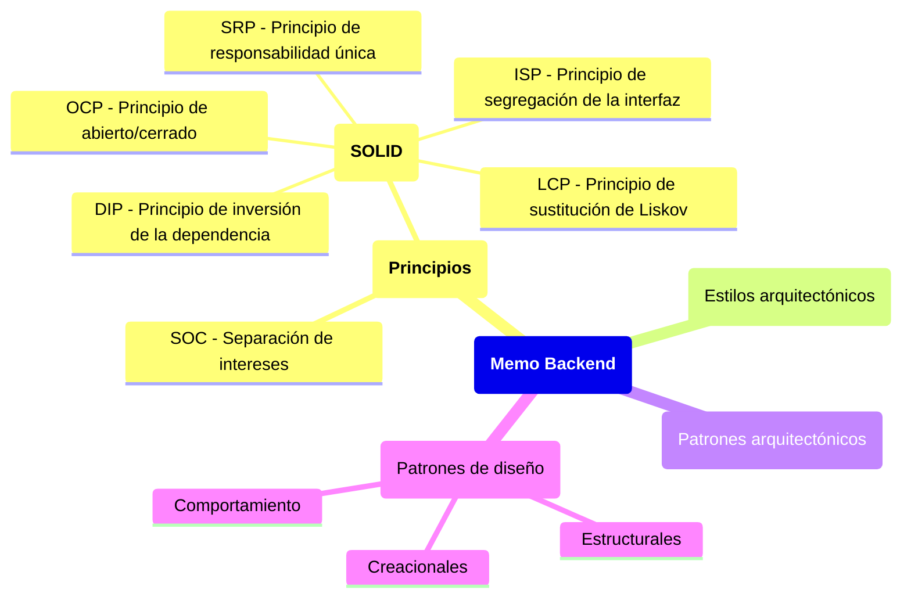
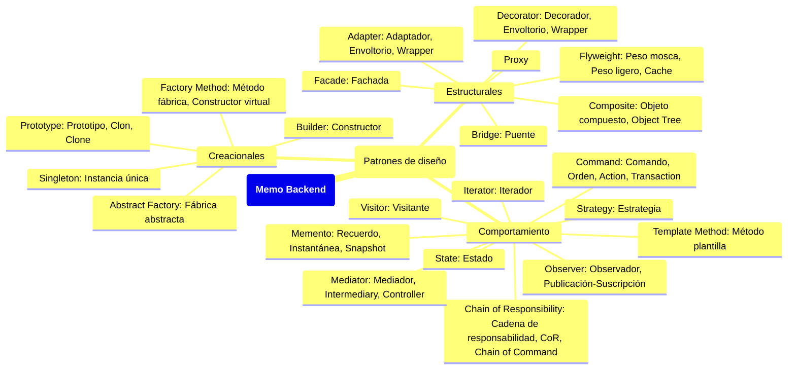
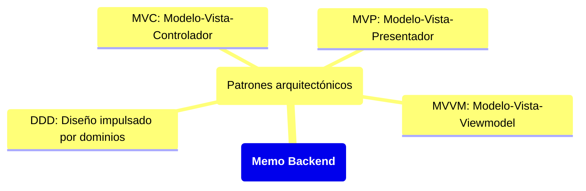
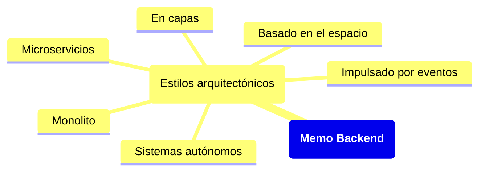

El siguiente gráfico conecta las ideas y los contenidos que podras encontrar próximamente en el sitio:

```mermaid
mindmap
  root("`**Memo Backend**`")
  ::icon(fas fa-memory)
    id("`**Principios**`")
        ::icon(fas fa-yin-yang)
        SOC - Separación de intereses
        id("`**SOLID**`")
        ::icon(fas fa-gem)
            SRP - Principio de responsabilidad única
            OCP - Principio de abierto/cerrado
            LCP - Principio de sustitución de Liskov
            ISP - Principio de segregación de la interfaz
            DIP - Principio de inversión de la dependencia
    id(Estilos arquitectónicos)
    ::icon(fas fa-university)
    id(Patrones arquitectónicos)
    ::icon(fas fa-igloo)
    id(Patrones de diseño)
    ::icon(fas fa-puzzle-piece)
        Creacionales
        ::icon(fas fa-industry)
        Estructurales
        ::icon(fas fa-cubes)
        Comportamiento
        ::icon(fas fa-key)
```  

### Patrones de diseño

```mermaid
mindmap
  root("`**Memo Backend**`")
  ::icon(fas fa-memory)
    id(Patrones de diseño)
    ::icon(fas fa-puzzle-piece)
        Creacionales
        ::icon(fas fa-industry)
            Factory Method: Método fábrica, Constructor virtual
            Abstract Factory: Fábrica abstracta
            Builder: Constructor
            Prototype: Prototipo, Clon, Clone
            Singleton: Instancia única
        Estructurales
        ::icon(fas fa-cubes)
            Adapter: Adaptador, Envoltorio, Wrapper
            Bridge: Puente
            Composite: Objeto compuesto, Object Tree
            Decorator: Decorador, Envoltorio, Wrapper
            Facade: Fachada
            Flyweight: Peso mosca, Peso ligero, Cache
            Proxy
        Comportamiento
        ::icon(fas fa-key)
            Chain of Responsibility: Cadena de responsabilidad, CoR, Chain of Command
            Command: Comando, Orden, Action, Transaction
            Iterator: Iterador
            Mediator: Mediador, Intermediary, Controller
            Memento: Recuerdo, Instantánea, Snapshot
            Observer: Observador, Publicación-Suscripción
            State: Estado
            Strategy: Estrategia
            Template Method: Método plantilla
            Visitor: Visitante
```  

### Patrones Arquitectónicos 

```mermaid
mindmap
  root("`**Memo Backend**`")
  ::icon(fas fa-memory)
    id(Patrones arquitectónicos)
    ::icon(fas fa-igloo)
        MVP: Modelo-Vista-Presentador
        MVC: Modelo-Vista-Controlador
        MVVM: Modelo-Vista-Viewmodel
        DDD: Diseño impulsado por dominios
```  

### Estilos Arquitectónicos

```mermaid
mindmap
  root("`**Memo Backend**`")
  ::icon(fas fa-memory)
    id(Estilos arquitectónicos)
    ::icon(fas fa-university)
        Monolito
        En capas
        Impulsado por eventos
        Sistemas autónomos
        Microservicios
        Basado en el espacio
    
```  