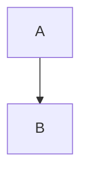

## Mermaid

Mermaid es una herramienta de diagramas y gráficos construida sobre JavaScript que utiliza definiciones de texto inspiradas en **Markdown** para crear y modificar diagramas complejos. Su objetivo principal es facilitar que la documentación se mantenga actualizada con el desarrollo.

### Sintaxis

Ttodas las definiciones de diagramas comienzan con una declaración del tipo de diagrama, seguida por las definiciones del diagrama y su contenido. 

Esta declaración notifica al analizador qué tipo de diagrama se supone que el código debe generar.

### Diagramas de flujo

Los diagramas de flujo se componen de nodos (formas geométricas) y aristas (flechas o líneas).

Las direcciones posibles del diagrama son:
* `TB` - arriba a abajo
* `BT` - de abajo hacia arribo
* `RL` - derecha a izquierda
* `LR` - izquierda a derecha
* `TD` - igual que TB, arriba a abajo

### Ejemplo

Sintaxis 
~~~~
mermaid
graph TB;
    A-->B;
~~~~

Resultado

